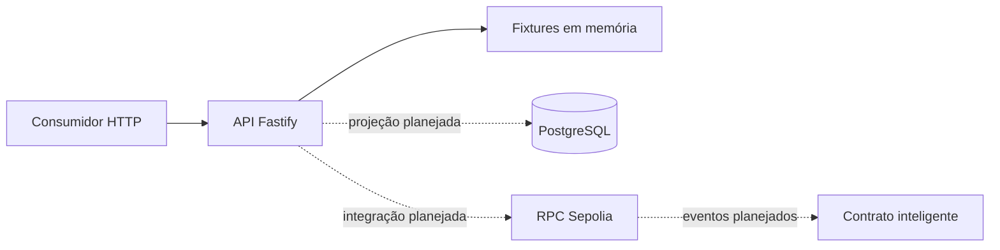

# backend-banco-inter

API HTTP somente leitura para a PoC de blockchain do Banco Inter. Serve dados fictícios a partir de um fixture em memória, sem persistência e sem assinatura de transações.

## Requisitos

- Node.js 24 (fixado em [`.nvmrc`](.nvmrc))
- npm

## Instalação

```bash
npm ci
npm run build
npm run start
```

O servidor sobe em `HOST` e `PORT` (padrão `127.0.0.1:3000`). Encerre com `Ctrl+C`. Para carregar variáveis de um arquivo `.env`, copie [`.env.example`](.env.example) e aponte explicitamente: `node --env-file=.env dist/src/server.js`.

## Scripts

| Comando                  | O que faz                                     |
| ------------------------ | --------------------------------------------- |
| `npm run build`           | Compila o TypeScript para `dist/`.            |
| `npm run start`           | Sobe o servidor compilado.                    |
| `npm test`                | Roda a suíte de testes.                       |
| `npm run coverage`        | Roda os testes com cobertura.                 |
| `npm run typecheck`       | Verifica os tipos sem gerar arquivos.         |
| `npm run lint`            | Analisa o código com o Biome.                 |
| `npm run format`          | Formata o código.                             |
| `npm run format:check`    | Verifica a formatação sem alterar arquivos.   |
| `npm run openapi:validate` | Valida o contrato OpenAPI gerado.            |

## Endpoints

| Método | Caminho                   | Descrição                                          |
| ------ | ------------------------- | -------------------------------------------------- |
| GET    | `/health`                 | Liveness. Devolve `{ "status": "ok" }`.            |
| GET    | `/ready`                  | Readiness. Lista dependências, hoje nenhuma.       |
| GET    | `/api/offers`             | Coleção de ofertas.                                |
| GET    | `/api/offers/:id`         | Detalhe de uma oferta.                             |
| GET    | `/api/operations`         | Coleção de operações.                              |
| GET    | `/api/operations/:txHash` | Detalhe de uma operação.                           |
| GET    | `/api/credit-limits`      | Coleção de limites de crédito.                     |
| GET    | `/openapi.json`           | O documento OpenAPI `0.1.0` servido pela aplicação. |
| GET    | `/docs`                   | Interface de documentação a partir do contrato.    |

As respostas de `/api/*` são mockadas. Cada uma traz `x-data-source: mock` no cabeçalho e `meta.source: "mock"` no corpo, para que ninguém confunda o fixture com dado real.

Erros usam `application/problem+json`, com `type`, `title`, `status`, `detail` e `correlationId`. Recursos inexistentes devolvem 404, parâmetros inválidos devolvem 400. Nenhuma resposta expõe stack trace, payload, SQL, URL de RPC ou variável de ambiente.

`/docs` é registrado como plugin de UI, não como rota com schema, então não aparece em `document.paths` do `/openapi.json`.

## Arquitetura



O que existe hoje são as arestas sólidas. As tracejadas estão planejadas: não há conexão PostgreSQL, driver `pg`, dependência viem nem configuração de RPC ou ABI nesta versão.

## Testes e CI

Os testes usam `node:test` e a injeção do Fastify, sem abrir porta nem depender de serviço externo. O workflow em [`.github/workflows/ci.yml`](.github/workflows/ci.yml) divide as verificações em dois jobs: `quality` roda `format:check`, `lint`, `typecheck` e `build`; `test` roda `coverage`, `openapi:validate` e `npm audit --omit=dev --audit-level=high`.
