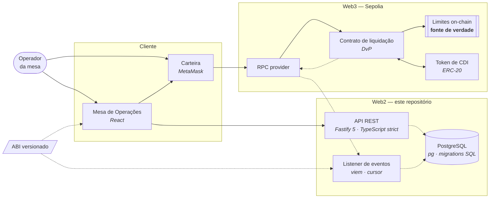

# Backend — Protocolo de crédito interfinanceiro

API e indexador da Prova de Conceito que automatiza o ciclo de crédito interbancário (CDI) overnight com contratos inteligentes. Desenvolvida pelo **Inteli Blockchain** em parceria com o **Banco Inter** (Digital Assets & Emerging Technologies).

> Projeto acadêmico e experimental. Opera exclusivamente em testnet (Sepolia), sem conexão com sistemas de produção e sem movimentação de ativos reais.

---

## O problema

Bancos emprestam reservas entre si por um dia útil para fechar o caixa dentro do mínimo regulatório. A taxa média dessas operações é o CDI. Hoje a negociação leva minutos e a liquidação leva horas, por causa de checagem manual de limite e conciliação. Nessa janela existe risco de contraparte: a operação foi combinada, mas ainda não foi consumada.

A PoC elimina a janela. O contrato valida o limite e executa a troca em uma única transação atômica: token de crédito de um lado, ativo de liquidação do outro. Ou as duas pernas acontecem, ou nenhuma.

## O papel deste repositório

O projeto tem três repositórios: contratos, frontend e este. Aqui fica a camada Web2. É ela que guarda o que não pode ir para uma rede pública e traduz o que acontece on-chain.

Três responsabilidades, e nada além delas:

1. API de consulta e registro: ofertas, operações, limites e histórico (RF04, RF05, RF06).
2. Listener de eventos: consulta os eventos do contrato na Sepolia por polling, com cursor, e grava status, hash, bloco, partes e taxa (RNF03).
3. Persistência: contrapartes, limites, histórico e o cursor de sincronização.

O que ele não faz: assinar transações. Quem assina é a carteira do operador, no frontend.

## Estado atual

Versão `0.1.0`. A API responde com um fixture em memória. Não há conexão com PostgreSQL, driver `pg`, dependência `viem` nem configuração de RPC ou ABI nesta versão. O listener, a persistência e a ligação com a Sepolia entram nas semanas 3 e 4.

Toda resposta de `/api/*` carrega `x-data-source: mock` no cabeçalho e `meta.source: "mock"` no corpo. A marcação custa uma linha e evita que fixture seja lido como dado real.

Consequência direta para a leitura dos requisitos: `RF05` e `RNF03` aparecem na matriz como `Documented`, e não como entregues, porque não existe Postgres nem listener. A origem de `RF05` é a API sobre o fixture, e nada mais.

## Começando

Requisitos: **Node.js 24** (fixado em [`.nvmrc`](.nvmrc)) e npm.

O `package.json` traz `devEngines` para a faixa `>=24 <25` com `onFail: "warn"`. Rodar fora da faixa não impede a instalação, mas o npm avisa, e é o que acontece neste repositório: o ambiente local roda Node 26 e o `EBADDEVENGINES` aparece a cada `npm ci`. `engine-strict` foi deliberadamente não adicionado. Ele quebraria a instalação no ambiente de quem mantém sem resolver a causa, que é o ambiente estar fora da faixa. Os dois jobs do CI leem `.nvmrc`, então o que é verificado roda no runtime declarado.

```bash
npm ci
npm run build
npm run start
```

O servidor sobe em `HOST` e `PORT` (padrão `127.0.0.1:3000`). Para carregar variáveis de um arquivo `.env`, copie [`.env.example`](.env.example) e aponte explicitamente:

```bash
node --env-file=.env dist/src/server.js
```

### Scripts

| Comando | O que faz |
| --- | --- |
| `npm run build` | Compila o TypeScript para `dist/` |
| `npm run start` | Sobe o servidor compilado |
| `npm test` | Roda a suíte de testes |
| `npm run coverage` | Roda os testes com cobertura, sobre `dist/src/**/*.js`, e falha abaixo de 80% de linhas, 75% de ramos e 75% de funções |
| `npm run coverage:lcov` | Gera `dist/lcov.info` a partir da suíte, pelo reporter nativo do Node |
| `npm run typecheck` | Verifica os tipos sem gerar arquivos |
| `npm run lint` | Analisa o código com o Biome |
| `npm run format` | Formata o código |
| `npm run format:check` | Verifica a formatação sem alterar arquivos |
| `npm run openapi:validate` | Valida o contrato OpenAPI gerado |

## API

| Método | Caminho | Descrição |
| --- | --- | --- |
| GET | `/health` | Liveness. Devolve `{ "status": "ok" }` |
| GET | `/ready` | Readiness. Lista dependências, hoje nenhuma |
| GET | `/api/offers` | Coleção de ofertas |
| GET | `/api/offers/:id` | Detalhe de uma oferta |
| GET | `/api/operations` | Coleção de operações |
| GET | `/api/operations/:txHash` | Detalhe de uma operação |
| GET | `/api/credit-limits` | Coleção de limites de crédito |
| GET | `/openapi.json` | Documento OpenAPI `0.1.0` servido pela aplicação |
| GET | `/docs` | Interface de documentação a partir do contrato |

Erros usam `application/problem+json`, com `type`, `title`, `status`, `detail` e `correlationId`. Recurso inexistente devolve 404, parâmetro inválido devolve 400. Nenhuma resposta expõe stack trace, payload, SQL, URL de RPC ou variável de ambiente.

As cinco rotas de `/api/*` rejeitam campo de querystring desconhecido com 400, o que faz um parâmetro escrito errado doer em vez de passar em silêncio. `/health`, `/ready` e `/openapi.json` aceitam qualquer parâmetro e não leem nenhum, porque sondas e monitores costumam anexar um.

`/docs` é registrado como plugin de UI, não como rota com schema, então não aparece em `document.paths` do `/openapi.json`.

## Arquitetura

Estrutura do sistema: quem existe e quem fala com quem. A ordem em que uma operação acontece está em [`docs/arquitetura.md`](docs/arquitetura.md), que é onde ela é medida.

Dentro do bloco Web2, aresta sólida é o que já existe e tracejada é o que ainda é alvo: o Postgres, o listener e a ligação com a Sepolia entram nas semanas 3 e 4. Fora dele, o desenho é o alvo, porque nenhum daqueles componentes mora neste repositório.



Nada é empurrado para o frontend nem para o listener: os dois perguntam em intervalo fixo e descobrem a mudança no ciclo seguinte.

### Decisões

O transporte é polling com cursor. O listener não recebe push: a cada ciclo ele lê o intervalo de blocos pendente no provedor de RPC e só então avança o cursor no Postgres. O frontend também não recebe push: pergunta à API em intervalo fixo.

WebSocket foi avaliado e não adotado. Ele entrega assim que o evento aparece, mas não recupera o que passou enquanto o canal esteve fora, então o cursor continuaria obrigatório de qualquer forma. Server-Sent Events exigiria uma rota de streaming e um canal de notificação no banco, duas peças a mais para um ganho de latência que o orçamento do RNF02 não precisa.

Gatilho objetivo para reabrir: o polling não sustentar o volume ou o SLO declarado, medidos e não estimados, ou o provedor de RPC impor teto de chamadas que o intervalo do ciclo não comporte.

As outras quatro decisões:

- O backend não assina transações. `viem` entra apenas como leitura, e quem assina é a carteira do operador. O backend nunca fica no caminho crítico da liquidação.
- O listener é um cursor, não um watcher. Guarda o último bloco processado, e qualquer parada, seja restart, deploy ou queda de rede, é recuperada na volta.
- A gravação é idempotente, por `UPSERT` sobre `(tx_hash, log_index)`. Reprocessar o mesmo evento não duplica histórico.
- O Postgres é espelho, nunca fonte de verdade. Em divergência, a chain está certa.

O raciocínio completo, com alternativas descartadas, orçamento de latência do RNF02, riscos conhecidos e caminho para produção, está em [`docs/arquitetura.md`](docs/arquitetura.md).

## Estrutura

```
src/
  app.ts            montagem do Fastify, plugins e OpenAPI
  server.ts         bootstrap e ciclo de vida do processo
  config.ts         leitura e validação das variáveis de ambiente
  problem.ts        erros em application/problem+json
  routes/
    health.ts       liveness e readiness
    mock-read.ts    rotas de leitura sobre o fixture
test/               testes com node:test e injeção do Fastify
docs/               arquitetura e decisões
```

## Testes e CI

Os testes usam `node:test` e a injeção do Fastify. Não abrem porta nem dependem de serviço externo. São 30, e o portão de cobertura é 80% de linhas, 75% de ramos e 75% de funções, aplicado sobre `dist/src/**/*.js`. Esse escopo existe para que um arquivo de `src/` que nenhum teste carrega apareça no relatório, com a cobertura real dele, em vez de sumir da conta.

O workflow em [`.github/workflows/ci.yml`](.github/workflows/ci.yml) divide as verificações em dois jobs, e os dois leem `.nvmrc` por `node-version-file`, portanto rodam no Node 24 declarado:

- `quality`, limite de 10 minutos: `npm ci`, `format:check`, `lint`, `typecheck` e `build`.
- `test`, limite de 15 minutos: `npm ci`, o portão de cobertura, a prova de estabilidade em três execuções, a geração do relatório LCOV, `openapi:validate` e a auditoria de dependências.

Etapas do job `test`, como estão hoje:

| Etapa | O que faz |
| --- | --- |
| Coverage gate | `npm run coverage --silent`. O `--silent` existe porque o banner do npm se interleaveava na saída e quebrava o `grep` da etapa seguinte |
| Prove the coverage gate is stable across three runs | Roda a cobertura três vezes, filtra a tabela por arquivo e faz `diff` entre a primeira execução e as outras duas; qualquer divergência falha o job |
| Produce the LCOV report | Gera `dist/lcov.info` com o reporter nativo do Node e falha se o arquivo estiver vazio. Não publica artefato de propósito: isso exigiria uma action de terceiros cujo SHA não foi verificado |
| Auditoria | `npm audit --audit-level=moderate`, sem `--omit=dev`. O compilador e o linter executam nos dois jobs, então a auditoria precisa alcançá-los |

O job `test` roda cinco vezes a suíte: uma para o portão, três para a prova de estabilidade e uma para o LCOV. Daí o limite de 15 minutos. Nenhuma action nova entrou no workflow.

## Requisitos: o que existe hoje e o que depende de terceiro

Só o `RNF04` está entregue por este repositório. Três requisitos estão descritos e não implementados, e três estão bloqueados por dependência de outro time.

| Requisito | Status oficial | O que existe hoje neste repositório | O que falta, e de quem depende |
| --- | --- | --- | --- |
| RF04 — painel com limites, taxas e estado | `Blocked` | `GET /api/credit-limits`, `/api/offers` e `/api/operations` servem o fixture, com `x-data-source: mock` | A exibição no frontend e a medição no prazo do RNF02. Depende do time de frontend (`DEP-FE-01`, prazo 2026-09-20, `Blocked`) e da definição formal do RNF02 |
| RF05 — histórico de operações | `Documented` | Nada persistido: as rotas de leitura respondem sobre um fixture em memória | PostgreSQL real, migrations e histórico que sobreviva a restart. É trabalho deste repositório, previsto para a Fase 3, e não está feito |
| RF06 — cancelamento antes do aceite | `Blocked` | Nenhuma rota de cancelamento; as rotas mock são somente leitura | A máquina de estados e o evento de cancelamento do contrato. Depende do time de contratos (`DEP-W3-01`, prazo 2026-09-20, `Blocked`) |
| RNF01 — apenas testnet, sem ativos reais | `Documented` | Nenhuma chave de produção e nenhuma configuração de rede: não há RPC nem chain ID nesta versão | A configuração de Sepolia, a revisão de configuração e o smoke. Depende do deploy inicial dos contratos (`DEP-W3-03`, prazo 2026-10-04, `Blocked`) |
| RNF02 — confirmação visível em até 30s | `Blocked` | Nenhuma medição ponta a ponta existe | A leitura adotada é que ele mede a chegada do estado à tela, e `pending` o satisfaz. A promoção a `confirmed` leva 12 blocos em liquidação, cerca de 144s, e é publicada como número separado. Falta a medição ponta a ponta, que depende do frontend e da carteira |
| RNF03 — rastreabilidade da operação | `Documented` | O esquema de resposta da operação no OpenAPI declara `txHash` e um rótulo fictício | Persistir e consultar timestamp, partes, taxa e hash; o listener não existe. É trabalho deste repositório, previsto para as Fases 3 e 4 |
| RNF04 — código aberto, sem dependência proprietária | `Verified` | `LICENSE` MIT rastreado e `npm audit --audit-level=moderate` sem vulnerabilidades | Nada |

RF01 a RF03 são atendidos pelo repositório de contratos, com apoio deste.

## Documentação

[`docs/arquitetura.md`](docs/arquitetura.md) traz componentes, decisões, orçamento de latência, riscos e caminho para produção. É um documento de outro time, que entrou em `main` pelo PR #2; o backend é consumidor dele, não autor. O transporte, o orçamento de latência e a seção de reorg descrevem o desenho aceito por este repositório, e qualquer mudança nele depende do time autor.

## Licença

MIT. Veja [`LICENSE`](LICENSE).
