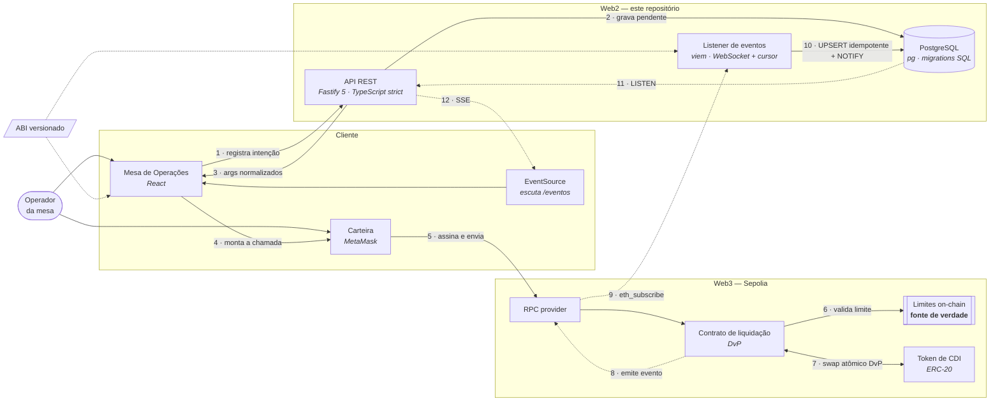

# Backend — Protocolo de crédito interfinanceiro

Backend da Prova de Conceito que automatiza o ciclo de crédito interbancário (CDI) overnight com contratos inteligentes, desenvolvida pelo **Inteli Blockchain** em parceria com o **Banco Inter** (Digital Assets & Emerging Technologies).

> Projeto acadêmico e experimental. Opera exclusivamente em testnet (Sepolia), sem conexão com sistemas de produção e sem movimentação de ativos reais.

## O problema

Bancos emprestam reservas entre si por um dia útil para fechar o caixa dentro do mínimo regulatório. A taxa média dessas operações é o CDI. Hoje a negociação leva minutos e a liquidação leva horas, por conta de checagem manual de limite e conciliação — e nessa janela existe risco de contraparte: a operação foi combinada mas ainda não foi consumada.

A PoC elimina a janela. O contrato inteligente valida o limite e executa a troca — token de crédito de um lado, ativo de liquidação do outro — em uma única transação atômica (DvP, *delivery versus payment*). Ou as duas pernas acontecem, ou nenhuma.

## O papel deste repositório

O projeto tem três repositórios: contratos, frontend e este. Aqui fica a camada Web2 — a que guarda o que não pode ir para uma rede pública e a que traduz o que acontece on-chain.

Este backend tem três responsabilidades e nada além delas:

1. **API de consulta e registro** — ofertas, aceites, cancelamentos, histórico e limites (RF05, RF06).
2. **Listener de eventos** — escuta o contrato na Sepolia e grava status, hash, bloco, partes e taxa no Postgres (RNF03).
3. **Persistência** — contrapartes, limites, histórico e o cursor de sincronização.

O que ele explicitamente **não** faz: assinar transações. Quem assina é a carteira do operador, no frontend. O backend é fonte de verdade off-chain e indexador, nunca executor.

## Stack

| Camada | Escolha | Por quê |
|---|---|---|
| Runtime | Node.js 24 LTS | Suporte de longo prazo, recomendado no TAP |
| Linguagem | TypeScript, modo estrito | Erros de tipo aparecem em build, não na demo |
| HTTP | Fastify 5 | Mais leve que Express, validação de schema nativa, SSE sem plugin externo |
| Banco | PostgreSQL | Recomendado no TAP; `LISTEN`/`NOTIFY` nativo dispensa Redis |
| Acesso ao banco | `pg` + migrations SQL | Sem ORM: a entrega pede ER explícito e migrations versionadas, e SQL puro deixa isso literal |
| Leitura on-chain | `viem` | Tipagem forte a partir do ABI, mais leve que ethers.js |
| Rede | Sepolia (testnet) | Exigência do RNF01 |

Alternativas descartadas e os motivos estão em [`docs/arquitetura.md`](docs/arquitetura.md).

## Arquitetura



Setas tracejadas são assíncronas. O raciocínio por trás de cada elemento — decisões, alternativas descartadas, orçamento de latência e riscos — está em [`docs/arquitetura.md`](docs/arquitetura.md).

### Decisões que valem saber de antemão

- **O backend não assina transações.** `viem` é usado somente para leitura.
- **O listener é um cursor, não um watcher.** Guarda o último bloco processado; qualquer parada é recuperada.
- **A gravação é idempotente.** `UPSERT` por `(tx_hash, log_index)` — reprocessar o mesmo evento não duplica histórico.
- **O Postgres é espelho, nunca fonte de verdade.** Em divergência, a chain está certa.

## Estrutura de pastas

```
src/
  config/           variáveis de ambiente e clientes (viem, pg)
  routes/           handlers HTTP do Fastify
  services/         regra de negócio, independente do transporte
  listener/         assinatura de eventos, cursor e reconciliação
  db/
    migrations/     migrations SQL versionadas
tests/              testes de integração
docs/               arquitetura e decisões
```

## Requisitos atendidos por este repositório

| Requisito | Onde |
|---|---|
| RF05 — histórico de operações | API + Postgres |
| RF06 — cancelamento | API + evento `Cancelled` indexado |
| RNF01 — apenas testnet | Sepolia, sem chave de produção |
| RNF02 — liquidação visível em até 30s | Listener por evento; orçamento medido em `docs/arquitetura.md` |
| RNF03 — rastreabilidade | Timestamp, partes, taxa e hash gravados pelo listener |
| RNF04 — código aberto | Licença MIT, sem dependência proprietária |

RF01 a RF04 são atendidos pelos repositórios de contratos e frontend, com apoio deste.

## Como rodar

Em desenvolvimento. O guia de instalação, com `.env` de exemplo, é entregue na semana 5.

## Documentação

- [`docs/arquitetura.md`](docs/arquitetura.md) — componentes, decisões, orçamento de latência, riscos e caminho para produção.

## Licença

MIT. Veja [`LICENSE`](LICENSE).
