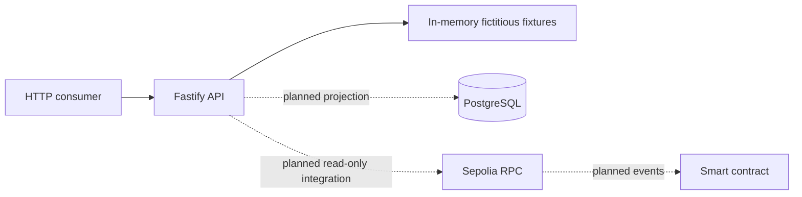

# backend-banco-inter

Read-only Fastify service for the Banco Inter blockchain PoC. It is an academic and experimental proof of concept: every result is a clearly labelled mock, using fictitious data and simulated assets on Sepolia only.

This repository is the tracked Week-1 delivery evidence. The executable service, its served OpenAPI `0.1.0` contract, and the documents linked below describe the same boundary.

## Supported runtime

- Node.js 24 LTS, pinned by [`.nvmrc`](.nvmrc) to `24` and enforced by the `engines` field (`>=24 <25`).
- npm with the committed `package-lock.json`.

Install the pinned runtime with any Node version manager (for example `nvm use` or `mise use node@24`) before installing dependencies.

**Known local versus CI runtime skew:** the local verification recorded for this delivery ran on Node `26.8.2`, while `.nvmrc` pins `24` and `engines` requires `>=24 <25`. Local installs therefore emit `EBADENGINE` warnings, and Node 24 behavior has **not** been verified locally. CI installs the `.nvmrc` runtime and is what **will** provide Node 24 verification; CI has not yet run for this delivery.

## Installation and verification

```bash
npm ci
npm run format:check
npm run lint
npm run typecheck
npm test
npm run coverage
npm run openapi:validate
npm run build
npm run start
```

`npm run start` runs the compiled server from `dist/` on `HOST` and `PORT`, so run `npm run build` first. Stop it with `Ctrl+C`.

These are the same checks that run in CI, split across two jobs in [`.github/workflows/ci.yml`](.github/workflows/ci.yml): a `quality` job runs `format:check`, `lint`, `typecheck`, and `build`, and a `test` job runs `coverage`, `openapi:validate`, and `npm audit --omit=dev --audit-level=high`. Both jobs install with `npm ci` on the `.nvmrc` runtime.

## Endpoints

| Method | Path                      | Description                                              |
| ------ | ------------------------- | -------------------------------------------------------- |
| GET    | `/health`                 | Liveness only; returns `{ "status": "ok" }`.             |
| GET    | `/ready`                  | Readiness; lists dependencies, which are currently none. |
| GET    | `/api/offers`             | Mock offer collection.                                   |
| GET    | `/api/offers/:id`         | Mock offer detail.                                       |
| GET    | `/api/operations`         | Mock operation collection.                               |
| GET    | `/api/operations/:txHash` | Mock operation detail.                                   |
| GET    | `/api/credit-limits`      | Mock credit-limit collection.                            |
| GET    | `/openapi.json`           | The served OpenAPI `0.1.0` document.                     |
| GET    | `/docs`                   | Interactive documentation UI rendered from that contract. |

`GET /docs` is served as a UI plugin rather than a schema route, so it does **not** appear in `document.paths` of `/openapi.json`. It is available and working; the OpenAPI document does not enumerate it.

Unknown resources return `application/problem+json` 404 responses. Invalid parameters, malformed input, and unexpected errors use the same Problem Details format with `type`, `title`, `status`, a safe `detail`, and a `correlationId`. No stack trace, payload, SQL, RPC URL, or environment value is included. Error responses are Problem Details and do **not** carry the mock marker described below.

## Mock identification

Every successful `/api/*` data response in this version carries `x-data-source: mock` in the response headers and `meta.source: "mock"` in the response body. The data is fictitious. It is **not** persisted and **not** on-chain data — it comes from an in-memory fixture. No operation has been submitted to a chain. This marking applies to successful data responses only; error responses are Problem Details and carry neither marker.

## Architecture



The solid edges are implemented: consumers call the API, which serves in-memory fictitious fixtures. The dashed edges are **planned, not implemented**. There is no PostgreSQL connection, no `pg` driver, no viem dependency, and no RPC or contract ABI configuration in this version. Those integrations arrive only when a concrete requirement defines their semantics.

## Scope boundaries

- Mock reads only. There is no financial command route, no authentication, no queue, cache, or worker.
- The service holds no participant key and signs no transaction.
- No secret is committed. [`.env.example`](.env.example) contains only safe values (`NODE_ENV`, `HOST`, `PORT`); configuration is validated at startup.

## Documentation

- [Foundation design](docs/superpowers/specs/2026-09-19-foundation-design.md)
- [Foundation implementation plan](docs/superpowers/plans/2026-09-19-foundation-implementation.md)
