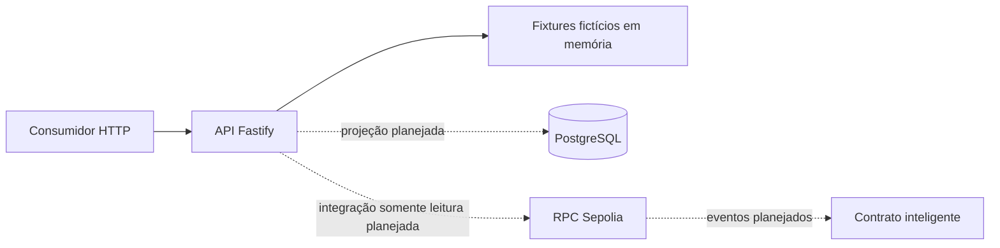

# backend-banco-inter

Serviço Fastify somente leitura para a PoC de blockchain do Banco Inter. É uma prova de conceito acadêmica e experimental: toda resposta é um mock declarado, com dados fictícios e ativos simulados, apenas na Sepolia.

Este repositório é a evidência rastreada da Semana 1. O serviço executável, o contrato OpenAPI `0.1.0` que ele serve e o diagrama de arquitetura abaixo descrevem o mesmo escopo.

## Runtime suportado

- Node.js 24 LTS, fixado em [`.nvmrc`](.nvmrc) e exigido pelo campo `engines` (`>=24 <25`).
- npm, com `package-lock.json` versionado.

Instale o runtime fixado com qualquer gerenciador de versões (`nvm use` ou `mise use node@24`) antes de instalar as dependências.

A verificação local desta entrega rodou em Node `26.8.2`, não em Node 24. Como `.nvmrc` fixa `24` e `engines` exige `>=24 <25`, instalações locais emitem avisos `EBADENGINE`, e o comportamento em Node 24 não foi observado aqui. Quem cobre esse runtime é o CI, que instala a versão do `.nvmrc`. O CI ainda não rodou para esta entrega.

## Instalação e verificação

```bash
npm ci
npm run format:check
npm run lint
npm run typecheck
npm test
npm run coverage
npm run openapi:validate
npm run build
npm run start
```

`npm run start` sobe o servidor compilado de `dist/` usando `HOST` e `PORT`, então rode `npm run build` antes. Encerre com `Ctrl+C`. Para carregar os valores de [`.env.example`](.env.example), copie o arquivo para `.env` e aponte explicitamente: `node --env-file=.env dist/src/server.js`.

O CI divide essas verificações em dois jobs, definidos em [`.github/workflows/ci.yml`](.github/workflows/ci.yml). O job `quality` roda `format:check`, `lint`, `typecheck` e `build`. O job `test` roda `coverage`, `openapi:validate` e `npm audit --omit=dev --audit-level=high`. Os dois instalam com `npm ci` no runtime do `.nvmrc`.

## Endpoints

| Método | Caminho                   | Descrição                                                   |
| ------ | ------------------------- | ----------------------------------------------------------- |
| GET    | `/health`                 | Liveness. Devolve `{ "status": "ok" }`.                     |
| GET    | `/ready`                  | Readiness. Lista dependências, hoje nenhuma.                |
| GET    | `/api/offers`             | Coleção de ofertas mockadas.                                |
| GET    | `/api/offers/:id`         | Detalhe de uma oferta mockada.                              |
| GET    | `/api/operations`         | Coleção de operações mockadas.                              |
| GET    | `/api/operations/:txHash` | Detalhe de uma operação mockada.                            |
| GET    | `/api/credit-limits`      | Coleção de limites de crédito mockados.                     |
| GET    | `/openapi.json`           | O documento OpenAPI `0.1.0` servido pela aplicação.         |
| GET    | `/docs`                   | Interface de documentação renderizada a partir do contrato. |

`GET /docs` é registrado como plugin de UI, não como rota com schema. Por isso ele não aparece em `document.paths` do `/openapi.json`. A rota funciona; o documento apenas não a enumera.

Recursos inexistentes devolvem 404 em `application/problem+json`. Parâmetros inválidos, entrada malformada e erros inesperados usam o mesmo formato, com `type`, `title`, `status`, `detail` seguro e `correlationId`. Nenhuma resposta carrega stack trace, payload, SQL, URL de RPC ou valor de ambiente.

## Identificação dos mocks

Toda resposta de dados bem-sucedida em `/api/*` traz `x-data-source: mock` no cabeçalho e `meta.source: "mock"` no corpo. Os dados são fictícios, vêm de um fixture em memória e não foram persistidos nem submetidos a nenhuma chain. Respostas de erro não levam esses marcadores: elas são Problem Details.

## Arquitetura



As arestas sólidas existem hoje: o consumidor chama a API, que serve fixtures fictícios em memória. As tracejadas são planejadas e não estão implementadas. Não há conexão PostgreSQL, driver `pg`, dependência viem nem configuração de RPC ou de ABI de contrato nesta versão. Cada integração entra quando houver requisito concreto que defina sua semântica.

## Limites de escopo

- Somente leitura mockada. Não existe rota de comando financeiro, autenticação, fila, cache ou worker.
- O serviço não guarda chave de participante nem assina transação.
- Nenhum segredo é versionado. [`.env.example`](.env.example) traz apenas valores seguros (`NODE_ENV`, `HOST`, `PORT`), e a configuração é validada na inicialização.
