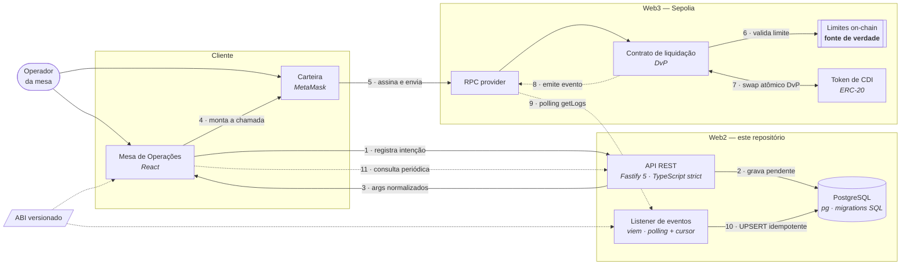

# Backend — Protocolo de crédito interfinanceiro

API e indexador da Prova de Conceito que automatiza o ciclo de crédito interbancário (CDI) overnight com contratos inteligentes. Desenvolvida pelo **Inteli Blockchain** em parceria com o **Banco Inter** (Digital Assets & Emerging Technologies).

> Projeto acadêmico e experimental. Opera exclusivamente em testnet (Sepolia), sem conexão com sistemas de produção e sem movimentação de ativos reais.

---

## O problema

Bancos emprestam reservas entre si por um dia útil para fechar o caixa dentro do mínimo regulatório — a taxa média dessas operações é o CDI. Hoje a negociação leva minutos e a liquidação leva horas, por causa de checagem manual de limite e conciliação. Nessa janela existe **risco de contraparte**: a operação foi combinada mas ainda não foi consumada.

A PoC elimina a janela. O contrato inteligente valida o limite e executa a troca — token de crédito de um lado, ativo de liquidação do outro — em uma única transação atômica (DvP, *delivery versus payment*). Ou as duas pernas acontecem, ou nenhuma.

## O papel deste repositório

O projeto tem três repositórios: contratos, frontend e este. Aqui fica a camada Web2 — a que guarda o que não pode ir para uma rede pública e a que traduz o que acontece on-chain.

Três responsabilidades, e nada além delas:

1. **API de consulta e registro** — ofertas, operações, limites e histórico (RF04, RF05, RF06).
2. **Listener de eventos** — escuta o contrato na Sepolia e grava status, hash, bloco, partes e taxa (RNF03).
3. **Persistência** — contrapartes, limites, histórico e o cursor de sincronização.

O que ele explicitamente **não** faz: assinar transações. Quem assina é a carteira do operador, no frontend.

## Estado atual

Versão `0.2.0`. Todas as rotas da API existem com o **payload final**, mas respondem com **dados fictícios em memória**: ainda não há PostgreSQL, driver `pg`, `viem`, RPC nem ABI ligados.

Toda resposta de `/api/*` carrega `x-data-source: mock` no cabeçalho e `meta.source: "mock"` no corpo, para que ninguém confunda fixture com dado real. As rotas de escrita validam as mesmas regras do contrato e guardam as intenções em memória até o processo reiniciar.

## Começando

Requisitos: **Node.js 24** (fixado em [`.nvmrc`](.nvmrc)) e npm.

```bash
npm ci
npm run build
npm run start
```

O servidor sobe em `HOST` e `PORT` (padrão `127.0.0.1:3000`). Para carregar variáveis de um arquivo `.env`, copie [`.env.example`](.env.example) e aponte explicitamente:

```bash
node --env-file=.env dist/src/server.js
```

### Scripts

| Comando | O que faz |
| --- | --- |
| `npm run build` | Compila o TypeScript para `dist/` |
| `npm run start` | Sobe o servidor compilado |
| `npm run docs:export` | Regera `docs/openapi.json` e a coleção Postman |
| `npm test` | Roda a suíte de testes |
| `npm run coverage` | Roda os testes com cobertura |
| `npm run typecheck` | Verifica os tipos sem gerar arquivos |
| `npm run lint` | Analisa o código com o Biome |
| `npm run format` | Formata o código |
| `npm run format:check` | Verifica a formatação sem alterar arquivos |
| `npm run openapi:validate` | Valida o contrato OpenAPI gerado |

## API

Referência completa, com payloads, erros e exemplos: **[`docs/api.md`](docs/api.md)**. Para testar sem ler código, importe a coleção [`docs/collection/backend-banco-inter.postman_collection.json`](docs/collection/backend-banco-inter.postman_collection.json) no Postman, Bruno ou Insomnia.

| Método | Caminho | Descrição |
| --- | --- | --- |
| GET | `/api/deployment` | Rede e endereços dos contratos |
| GET | `/api/sync-status` | Último bloco indexado e atraso do listener |
| GET | `/api/offers` | Ofertas, com filtros por status, carteira e lado |
| POST | `/api/offers` | Intenção de criar oferta direcionada |
| GET | `/api/offers/:id` | Detalhe da oferta, com a liquidação |
| GET | `/api/offers/:id/events` | Histórico on-chain da oferta |
| POST | `/api/offers/:id/accept` | Intenção de aceitar (tomador) |
| POST | `/api/offers/:id/reject` | Intenção de rejeitar (tomador) |
| POST | `/api/offers/:id/cancel` | Intenção de cancelar (ofertante) |
| GET | `/api/transaction-requests/:id` | Estado de uma intenção |
| POST | `/api/transaction-requests/:id/submission` | Informa o hash assinado pela carteira |
| GET | `/api/operations` | Histórico de operações liquidadas |
| GET | `/api/operations/:txHash` | Comprovante da operação |
| GET | `/api/credit-limits` | Limites por carteira (e filtro de tomadores elegíveis) |
| GET | `/api/credit-limits/:wallet` | Limite de uma carteira |
| GET | `/api/credit-limits/:wallet/history` | Histórico de mudanças de limite |
| GET | `/health` | Liveness. Devolve `{ "status": "ok" }` |
| GET | `/ready` | Readiness. Lista dependências, hoje nenhuma |
| GET | `/openapi.json` | Documento OpenAPI `0.2.0` servido pela aplicação |
| GET | `/docs` | Interface de documentação a partir do contrato |

A API não assina transações: as rotas `POST` registram a **intenção** e devolvem `contractCall` para a carteira do operador assinar. Elas exigem o cabeçalho `X-Wallet-Address`, provisório até existir login assinado.

Erros usam `application/problem+json`, com `type`, `title`, `status`, `detail` e `correlationId`; a lista de tipos está em [`docs/api.md`](docs/api.md#3-erros). Nenhuma resposta expõe stack trace, SQL, URL de RPC ou variável de ambiente.

`/docs` é registrado como plugin de UI, não como rota com schema, então não aparece em `document.paths` do `/openapi.json`.

## Arquitetura

O desenho alvo do sistema. As arestas sólidas dentro do bloco Web2 são o que já existe; o listener, o Postgres e a ligação com a Sepolia entram nas semanas 3 e 4.


```mermaid
flowchart LR
    OP(["Operador<br/>da mesa"])

    subgraph CLIENT["Cliente"]
        FE["Mesa de Operações<br/><i>React</i>"]
        WALLET["Carteira<br/><i>MetaMask</i>"]
    end

    subgraph WEB2["Web2 — este repositório"]
        API["API REST<br/><i>Fastify 5 · TypeScript strict</i>"]
        LIS["Listener de eventos<br/><i>viem · polling + cursor</i>"]
        DB[("PostgreSQL<br/><i>pg · migrations SQL</i>")]
    end

    subgraph WEB3["Web3 — Sepolia"]
        RPC["RPC provider"]
        DVP["Contrato de liquidação<br/><i>DvP</i>"]
        LIM[["Limites on-chain<br/><b>fonte de verdade</b>"]]
        TOKEN["Token de CDI<br/><i>ERC-20</i>"]
    end

    ABI[/"ABI versionado"/]

    OP --> FE
    OP --> WALLET

    FE -->|"1 · registra intenção"| API
    API -->|"2 · grava pendente"| DB
    API -->|"3 · args normalizados"| FE
    FE -->|"4 · monta a chamada"| WALLET
    WALLET -->|"5 · assina e envia"| RPC
    RPC --> DVP
    DVP -->|"6 · valida limite"| LIM
    DVP <-->|"7 · swap atômico DvP"| TOKEN
    DVP -.->|"8 · emite evento"| RPC
    RPC -.->|"9 · polling getLogs"| LIS
    LIS -->|"10 · UPSERT idempotente"| DB
    FE -.->|"11 · consulta periódica"| API

    ABI -.-> LIS
    ABI -.-> FE
```

Setas tracejadas são assíncronas. O frontend e o listener descobrem mudanças por polling; não há rota SSE nem `eth_subscribe` no serviço atual.

### Decisões

- **O backend não assina transações.** `viem` entra apenas como leitura. Quem assina é a carteira do operador, então o backend nunca fica no caminho crítico da liquidação.
- **O listener é um cursor, não um watcher.** Guarda o último bloco processado; qualquer parada — restart, deploy, queda de rede — é recuperada na volta.
- **A gravação é idempotente.** `UPSERT` por `(tx_hash, log_index)`. Reprocessar o mesmo evento não duplica histórico.
- **O Postgres é espelho, nunca fonte de verdade.** Em divergência, a chain está certa.

O raciocínio completo — alternativas descartadas, orçamento de latência do RNF02, riscos conhecidos e caminho para produção — está em [`docs/arquitetura.md`](docs/arquitetura.md).

## Estrutura

```
src/
  app.ts              montagem do Fastify, plugins, erros e OpenAPI
  server.ts           bootstrap e ciclo de vida do processo
  config.ts           leitura e validação das variáveis de ambiente
  domain.ts           tipos e unidades espelhando o contrato e a migration
  schemas.ts          esquemas JSON compartilhados (componentes do OpenAPI)
  problem.ts          erros em application/problem+json
  http.ts             envelope { data, meta } das respostas
  mock/
    fixtures.ts       massa fictícia coerente com o contrato
    store.ts          estado em memória no lugar do Postgres
  routes/
    health.ts         liveness e readiness
    chain.ts          contratos implantados e estado do listener
    offers.ts         ofertas e intenções de criar, aceitar, rejeitar e cancelar
    transaction-requests.ts  consulta de intenção e envio do hash
    operations.ts     operações liquidadas
    credit-limits.ts  limites e histórico
scripts/
  export-docs.ts      gera docs/openapi.json e a coleção Postman
migrations/           esquema SQL versionado
test/                 testes com node:test e injeção do Fastify
docs/                 arquitetura, modelagem, API, OpenAPI e coleção
```

## Testes e CI

Os testes usam `node:test` e a injeção do Fastify — não abrem porta nem dependem de serviço externo.

O workflow em [`.github/workflows/ci.yml`](.github/workflows/ci.yml) divide as verificações em dois jobs:

- **`quality`** — `format:check`, `lint`, `typecheck` e `build`
- **`test`** — `coverage`, `openapi:validate` e `npm audit --omit=dev --audit-level=high`

## Requisitos atendidos por este repositório

| Requisito | Onde |
| --- | --- |
| RF04 — painel de operações | API serve limites, taxas e status |
| RF05 — histórico de operações | API + Postgres |
| RF06 — cancelamento | API + evento `Cancelled` indexado |
| RNF01 — apenas testnet | Sepolia, sem chave de produção |
| RNF02 — liquidação visível em até 30s | Listener por evento; orçamento medido em [`docs/arquitetura.md`](docs/arquitetura.md) |
| RNF03 — rastreabilidade | Timestamp, partes, taxa e hash gravados pelo listener |
| RNF04 — código aberto | Licença MIT, sem dependência proprietária |

RF01 a RF03 são atendidos pelo repositório de contratos, com apoio deste.

## Documentação

- [`docs/arquitetura.md`](docs/arquitetura.md) — componentes, decisões, orçamento de latência, riscos e caminho para produção.
- [`docs/api.md`](docs/api.md) — referência da API: rotas, payloads, erros, estados e massa mock.
- [`docs/openapi.json`](docs/openapi.json) e [`docs/collection/`](docs/collection/) — contrato OpenAPI e coleção Postman gerados por `npm run docs:export`.
- [`docs/modelagem-banco.md`](docs/modelagem-banco.md) — modelo entidade-relacionamento alinhado ao contrato DvP; esquema SQL em [`migrations/001_initial_schema.sql`](migrations/001_initial_schema.sql).

## Licença

MIT. Veja [`LICENSE`](LICENSE).
