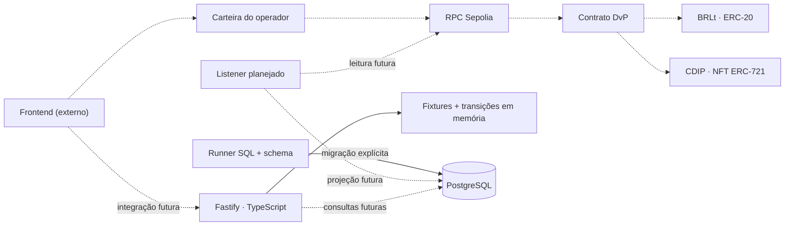

# Backend — Protocolo de crédito interfinanceiro

API mock e esquema de persistência da prova de conceito de crédito interbancário overnight, desenvolvidos pelo **Inteli Blockchain** com o **Banco Inter** (Digital Assets & Emerging Technologies).

> Projeto acadêmico e experimental. Opera exclusivamente em testnet (Sepolia), sem conexão com sistemas de produção e sem movimentação de ativos reais.

---

## O problema

Bancos emprestam reservas entre si por um dia útil para fechar o caixa dentro do mínimo regulatório — a taxa média dessas operações é o CDI. Hoje a negociação leva minutos e a liquidação leva horas, por causa de checagem manual de limite e conciliação. Nessa janela existe **risco de contraparte**: a operação foi combinada mas ainda não foi consumada.

A PoC propõe reduzir essa janela. No fluxo on-chain pretendido, o contrato inteligente valida o limite e executa a troca — token de crédito de um lado, ativo de liquidação do outro — em uma única transação atômica (DvP, *delivery versus payment*). Ou as duas pernas acontecem, ou nenhuma; a API deste repositório ainda não executa esse fluxo.

## O papel deste repositório

O projeto tem três repositórios: contratos, frontend e este. Aqui fica a camada Web2 — a que guarda o que não pode ir para uma rede pública e a que traduz o que acontece on-chain.

Neste repositório estão a API de leitura com dados fictícios, os comandos de simulação DvP e o modelo SQL para a futura projeção dos eventos da Sepolia. O backend não assina, transmite ou confirma transações.

## Estado atual

Versão `0.3.0`. Leituras `/api/*` devolvem somente fixtures por instância; ainda não existe conexão do servidor ao PostgreSQL, RPC ou listener. O driver `pg`, a migration inicial e o runner SQL estão disponíveis, mas **executar a migration não conecta a API ao banco**. A integração com frontend, contratos e indexação depende de outras entregas.

Toda resposta **bem-sucedida** de `/api/*` traz `X-Data-Source: mock` e `meta.source: "mock"`; erros são `application/problem+json` sem marcador. Hashes, blocos, endereços e comprovantes expostos são sintéticos, não prova de liquidação.

Em `development`/`test`, `/api/mock/offers` cria ofertas fictícias e `/api/mock/offers/:id/{accept,reject,cancel}` altera ofertas, eventos, limites e operações **apenas em memória**. Nesse ambiente também existem intenções de assinatura sob `/api/offers` e envio de hash sob `/api/transaction-requests`. `X-Wallet-Address` é dado fornecido pelo cliente, **não autenticação**; uma intenção não liquida nada e não alimenta o histórico sem listener. Em `production` todos os `POST` são 404 e não aparecem no OpenAPI servido. Sem `NODE_ENV`, tanto `buildApp()` quanto o servidor usam **production** por segurança.

## Começando

### Com Docker Compose — API e banco em um comando

Requisito: Docker com o plugin Docker Compose. Na raiz do repositório:

```bash
docker compose up --build -d
```

O Compose constrói a API com Node.js 24 e sobe dois containers: `api` e `db`
(PostgreSQL 17). A API inicia depois que o banco aceita conexões. Não é
necessário instalar Node.js ou PostgreSQL no computador para usar esse ambiente.

- API: <http://localhost:3000>
- Documentação interativa: <http://localhost:3000/docs>
- Healthcheck: <http://localhost:3000/health>
- PostgreSQL: `localhost:5432`, banco `banco_inter`, usuário `banco_inter`, senha local `banco_inter_local`.

As portas publicadas ficam acessíveis apenas no próprio computador. Para alterar
portas ou credenciais, copie `.env.example` para `.env` e ajuste `API_PORT`,
`POSTGRES_PORT`, `POSTGRES_DB`, `POSTGRES_USER` e `POSTGRES_PASSWORD` antes da
primeira inicialização. O comando funciona também sem `.env`, usando esses padrões.

O banco aplica `migrations/001_initial_schema.sql` automaticamente quando o volume
`postgres_data` está vazio. Esse mecanismo inicializa o esquema; arquivos SQL
adicionados ou alterados depois não são reaplicados automaticamente. O volume
preserva os dados ao parar e recriar os containers. Alterar credenciais em `.env`
também não modifica um banco que já foi inicializado.

**A API continua em modo mock.** Subir os dois serviços não implementa persistência:
as rotas ainda usam `MockStore`, e as intenções em memória desaparecem ao reiniciar
a API. Quando a conexão `pg` for implementada, a API deverá acessar o banco pelo
host `db`, porta `5432`, dentro da rede do Compose.

Para consultar o estado, acompanhar logs, abrir o banco e encerrar o ambiente:

```bash
docker compose ps
docker compose logs -f
docker compose exec db sh -c 'psql -U "$POSTGRES_USER" -d "$POSTGRES_DB"'
docker compose down
```

`docker compose down` preserva os dados do PostgreSQL. Para apagar os dados locais
e recriar o esquema na próxima inicialização, use `docker compose down -v`.

### Com Node.js instalado no computador

Requisitos: **Node.js 24** (fixado em [`.nvmrc`](.nvmrc)) e npm.

```bash
npm ci
npm run build
npm run start
```

Para exercitar os POSTs fictícios da coleção, inicie explicitamente em modo de desenvolvimento local:

```bash
NODE_ENV=development npm run start
```

O servidor sobe em `HOST` e `PORT` (padrão `127.0.0.1:3000`). Para carregar variáveis de um `.env` local com `NODE_ENV=development`, copie [`.env.example`](.env.example) e aponte explicitamente:

```bash
node --env-file=.env dist/src/server.js
```

### Scripts

| Comando | O que faz |
| --- | --- |
| `npm run build` | Compila o TypeScript para `dist/` |
| `npm run start` | Sobe o servidor compilado |
| `npm run db:migrate` | Aplica migrations SQL com `DATABASE_URL` (PostgreSQL separado da API) |
| `npm run test:db` | Testa migration em schema descartável com `TEST_DATABASE_URL` |
| `npm run docs:export` | Regera `docs/openapi.json` e a coleção Postman |
| `npm test` | Roda a suíte de testes |
| `npm run coverage` | Roda os testes com cobertura |
| `npm run typecheck` | Verifica os tipos sem gerar arquivos |
| `npm run lint` | Analisa o código com o Biome |
| `npm run format` | Formata o código |
| `npm run format:check` | Verifica a formatação sem alterar arquivos |
| `npm run openapi:validate` | Valida o contrato OpenAPI gerado |

## API

Referência completa, com payloads, erros e exemplos: **[`docs/api.md`](docs/api.md)**. Para testar sem ler código, importe a coleção [`docs/collection/backend-banco-inter.postman_collection.json`](docs/collection/backend-banco-inter.postman_collection.json) no Postman, Bruno ou Insomnia.

| Método | Caminho | Disponibilidade |
| --- | --- | --- |
| GET | `/api/deployment`, `/api/sync-status` | Endereços e cursor **fictícios** |
| GET | `/api/offers`, `/api/offers/:id`, `/api/offers/:id/events` | Ofertas e eventos fictícios |
| GET | `/api/operations`, `/api/operations/:txHash` | Operações e comprovantes fictícios |
| GET | `/api/credit-limits`, `/api/credit-limits/:wallet`, `/api/credit-limits/:wallet/history` | Limites e histórico fictícios |
| GET | `/api/transaction-requests/:id` | Leitura de intenções da instância |
| POST | `/api/mock/offers`, `/api/mock/offers/:id/{accept,reject,cancel}` | **Somente development/test**; simulação sem autenticação ou transação |
| POST | `/api/offers`, `/api/offers/:id/{accept,reject,cancel}`, `/api/transaction-requests/:id/submission` | **Somente development/test**; intenções, não execução |
| GET | `/health`, `/ready`, `/openapi.json`, `/docs` | Saúde e documentação da configuração ativa |

O OpenAPI exportado e a coleção Postman representam o ambiente `development`. O OpenAPI servido em `production` omite as operações POST. Para aplicar o esquema a um PostgreSQL escolhido explicitamente, defina `DATABASE_URL` e execute `npm run db:migrate`; o comando não popula fixtures nem altera a fonte de dados da API.

Erros usam `application/problem+json`, com `type`, `title`, `status`, `detail` e `correlationId`; a lista de tipos está em [`docs/api.md`](docs/api.md#3-erros). Nenhuma resposta expõe stack trace, SQL, URL de RPC ou variável de ambiente.

`/docs` é registrado como plugin de UI, não como rota com schema, então não aparece em `document.paths` do `/openapi.json`.

## Arquitetura

O diagrama separa o que esta base executa (setas sólidas) das integrações pretendidas (tracejadas). O frontend e o contrato ficam em repositórios separados; nenhum fluxo externo está ligado à API atual.


```mermaid
flowchart LR
    FE["Frontend (externo)"]
    W["Carteira do operador"]
    RPC["RPC Sepolia"]
    DVP["Contrato DvP"]
    BRL["BRLt · ERC-20"]
    CDIP["CDIP · NFT ERC-721"]
    API["Fastify · TypeScript"]
    MOCK["Fixtures + transições em memória"]
    MIG["Runner SQL + schema"]
    DB[("PostgreSQL")]
    LIS["Listener planejado"]

    FE -.->|"integração futura"| API
    FE -.-> W
    W -.-> RPC
    RPC -.-> DVP
    DVP -.-> BRL
    DVP -.-> CDIP
    API --> MOCK
    MIG -->|"migração explícita"| DB
    LIS -.->|"leitura futura"| RPC
    LIS -.->|"projeção futura"| DB
    API -.->|"consultas futuras"| DB
```

O contrato é a autoridade financeira. O banco será uma projeção reconstruível de eventos, não executor da troca. Antes de expor mutações reais, faltam autenticação de carteira e autorização institucional, persistência de intenções, listener com replay/reorg e integração de consumidor. Orçamento de latência é uma hipótese de projeto, **não** um SLO medido.

Tecnologias, alternativas e riscos: [`docs/arquitetura.md`](docs/arquitetura.md).

## Estrutura

```
src/
  app.ts              composição do Fastify, ambientes, erros e OpenAPI
  server.ts           bootstrap e ciclo de vida
  domain.ts           tipos e unidades do contrato DvP
  schemas.ts          schemas JSON/OpenAPI
  db/migrate.ts       runner PostgreSQL versionado e serializado
  mock/               fixtures, projeções e transições fictícias
  routes/             consultas, intenções e simulação
scripts/
  migrate.ts          comando explícito de migrations
  export-docs.ts      OpenAPI e coleção Postman do ambiente development
migrations/           esquema SQL versionado
test/                 testes HTTP e integração PostgreSQL opcional
docs/                 arquitetura, modelagem e referência de API
```

## Testes e CI

`npm test` executa testes HTTP com `app.inject()` e testes de migration quando `TEST_DATABASE_URL` estiver definido. `npm run test:db` **exige** essa variável e usa um schema descartável em um PostgreSQL de teste; não execute contra um banco de produção. O CI provisiona PostgreSQL 16 efêmero e roda a migração real, idempotência, concorrência e rollback. O servidor não abre conexão com o banco.

O workflow em [`.github/workflows/ci.yml`](.github/workflows/ci.yml) executa formatação, lint, typecheck, build, cobertura, OpenAPI, testes de banco e auditoria de dependências. A aprovação local não substitui o resultado do CI remoto.

## Escopo dos requisitos

| Requisito | Estado nesta base |
| --- | --- |
| RF04/05 | Consultas e histórico **mock**; sem integração à mesa nem indexação |
| RF06 | Cancelamento **simulado**; o contrato real não é chamado |
| RNF01 | Fixtures rotuladas Sepolia; sem conexão RPC |
| RNF02 | Meta de latência pendente de listener, integração e medição |
| RNF03 | Campos de trilha no modelo e fixtures; sem trilha observada on-chain |
| RNF04 | Código e licença MIT disponíveis no repositório |

RF01–RF03 dependem do trabalho de contratos e da validação entre equipes; não são concluídos por esta API mock.

## Documentação
- [`docs/arquitetura.md`](docs/arquitetura.md) — arquitetura atual e alvo, decisões e trade-offs.
- [`docs/api.md`](docs/api.md) — contrato HTTP, limites do mock e exemplos.
- [`docs/openapi.json`](docs/openapi.json) e [`docs/collection/`](docs/collection/) — artefatos de `npm run docs:export` para `development`.
- [`docs/modelagem-banco.md`](docs/modelagem-banco.md) — modelo ER; esquema em [`migrations/001_initial_schema.sql`](migrations/001_initial_schema.sql).

## Licença

MIT. Veja [`LICENSE`](LICENSE).
