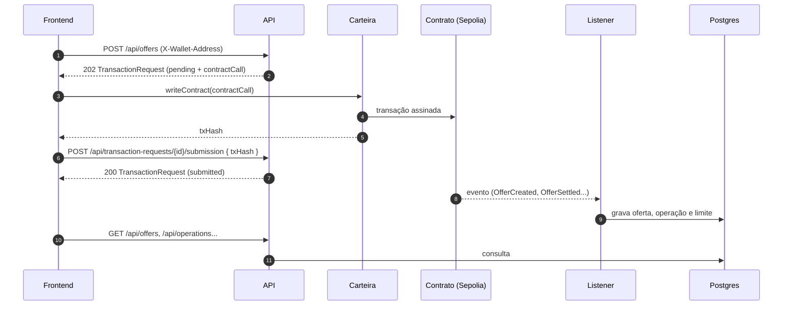
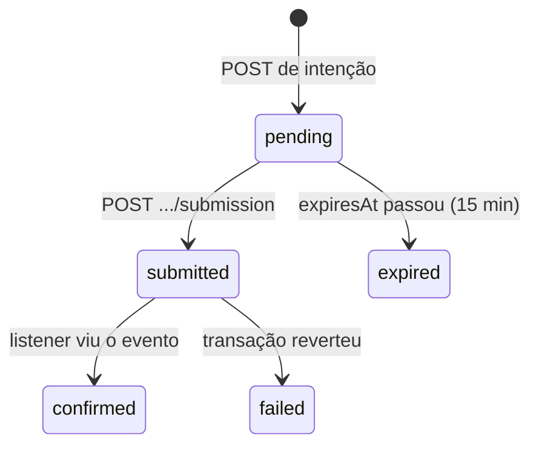

# API — referência completa (v0.2.0, mock)

Contrato HTTP entre o backend e a Mesa de Operações. Nesta versão **todas as respostas de `/api/*` são fictícias**, mas o formato já é o final: quando os mocks saírem, muda a origem dos dados, não o payload.

| Artefato | Para quê |
| --- | --- |
| [`docs/openapi.json`](openapi.json) | Contrato OpenAPI 3.0 (gerar tipos, validar) |
| [`docs/collection/backend-banco-inter.postman_collection.json`](collection/backend-banco-inter.postman_collection.json) | Coleção Postman v2.1 com exemplos reais de sucesso e erro |
| `GET /docs` | Swagger UI com a API rodando |
| `GET /openapi.json` | O mesmo contrato servido pela aplicação |

Os dois arquivos são gerados pela própria API (`npm run docs:export`). Um teste falha se `docs/openapi.json` ficar diferente do contrato servido ou se a coleção deixar de cobrir alguma rota.

**Alinhamento:** contrato `CreditInterbankOffer` da branch `develop` do repositório de contratos (commit `b68cf40`) e esquema de [`migrations/001_initial_schema.sql`](../migrations/001_initial_schema.sql).

---

## Sumário

1. [Como a API funciona](#1-como-a-api-funciona)
2. [Convenções](#2-convenções)
3. [Erros](#3-erros)
4. [Rotas](#4-rotas)
5. [Recursos](#5-recursos)
6. [Estados](#6-estados)
7. [Massa de dados mock](#7-massa-de-dados-mock)
8. [Usando a coleção](#8-usando-a-coleção)
9. [O que muda quando os mocks saírem](#9-o-que-muda-quando-os-mocks-saírem)

---

## 1. Como a API funciona

A API **não assina nem envia transações**. Leituras vêm do Postgres (hoje, do mock). Escritas são **intenções**: a API valida o pedido com as mesmas regras do contrato e devolve `contractCall`, que o frontend passa para a carteira.



Os passos 8 e 9 são do listener e ainda não existem. Na versão mock, a intenção fica em `submitted` e as listas não mudam.

Exemplo com viem/wagmi, usando a resposta da intenção:

```ts
const { contractCall } = intent.data;
const hash = await walletClient.writeContract({
  abi: creditInterbankOfferAbi,
  address: contractCall.contractAddress,
  functionName: contractCall.functionName,
  // endereços ficam como string; inteiros viram BigInt
  args: contractCall.args.map((a) => (a.startsWith("0x") ? a : BigInt(a))),
  chainId: contractCall.chainId,
});
await fetch(`/api/transaction-requests/${intent.data.id}/submission`, {
  method: "POST",
  headers: { "content-type": "application/json", "x-wallet-address": account },
  body: JSON.stringify({ txHash: hash }),
});
```

Para o aceite funcionar, a carteira do **ofertante** precisa ter dado `approve` do BRLt para o contrato (valor ≥ `amountCents`) e ter esse saldo. O melhor momento é logo depois de criar a oferta. A API não checa isso; se faltar, `acceptOffer` reverte e a oferta continua `offered`.

---

## 2. Convenções

### Envelope

Toda resposta 2xx de `/api/*` tem o cabeçalho `X-Data-Source: mock` e este formato:

```json
{ "data": { }, "meta": { "source": "mock" } }
```

Listas paginadas (`/api/offers`, `/api/operations`) trazem também `total`, `limit` e `offset` em `meta`. As outras listas vêm inteiras.

Respostas de erro **não** têm envelope nem `X-Data-Source` (veja [Erros](#3-erros)).

### Tipos e unidades

| Campo | Formato | Exemplo |
| --- | --- | --- |
| `*Cents` | string decimal, centavos de BRLt (uint256) | `"100000000"` = R$ 1.000.000,00 |
| `rateCdiBps` | inteiro, pontos-base do CDI | `10500` = 105% do CDI |
| `termDays` | inteiro, prazo do empréstimo em dias | `1` = overnight |
| `validitySeconds` | inteiro, janela da oferta em segundos | `3600` |
| `onchainOfferId`, `positionTokenId` | string decimal (uint256) | `"8"` |
| carteira / endereço | `0x` + 40 hex; a API aceita qualquer caixa e devolve minúsculo | `0xa1a1…a1` |
| `txHash`, `blockHash` | `0x` + 64 hex | |
| ids da API | UUID | `a0000000-0000-4000-8000-000000000008` |
| datas | ISO 8601 em UTC | `2026-09-29T12:00:00.000Z` |

**Por que valores em string?** Inteiros do contrato são uint256 e passam de `Number.MAX_SAFE_INTEGER`. Converta com `BigInt(valor)`. Para exibir: `(BigInt(c) / 100n)` reais e `c % 100n` centavos, ou `Number(c) / 100` se o valor couber. `amountCents` enviado como número no corpo é recusado com 400.

### Identificação da carteira

Rotas `POST` exigem o cabeçalho **`X-Wallet-Address`** com a carteira que vai assinar. É provisório: ainda não há autenticação, então a API confia no cabeçalho. Antes de ligar ao Postgres ele será trocado por login assinado (SIWE). O formato das respostas não muda.

### Paginação

`limit` (1 a 100, padrão 50) e `offset` (padrão 0). Ordem: mais recente primeiro.

### Validação

Parâmetros desconhecidos em query ou corpo dão 400, e não são ignorados. Corpo JSON limitado a 16 KiB.

---

## 3. Erros

Formato [RFC 9457](https://www.rfc-editor.org/rfc/rfc9457), `Content-Type: application/problem+json`:

```json
{
  "type": "https://api.example.invalid/problems/insufficient-limit",
  "title": "Limite insuficiente",
  "status": 422,
  "detail": "O tomador tem 15000000000 centavos de limite disponível e a oferta pede 99900000000.",
  "correlationId": "req-e"
}
```

Use `type` (ou o final dele) para decidir o que mostrar; `detail` é texto para pessoas e pode mudar. `correlationId` é o id da requisição no log.

| Status | `type` (final da URI) | Quando | Espelha no contrato |
| --- | --- | --- | --- |
| 400 | `validation-error` | Parâmetro, cabeçalho ou corpo inválido; JSON malformado | `InvalidOfferParameters`, `InvalidValidityWindow` |
| 403 | `not-registered-institution` | Carteira do `X-Wallet-Address` não cadastrada ou revogada | `NotRegisteredInstitution` |
| 403 | `not-eligible-borrower` | Aceitar ou rejeitar sem ser o tomador | `NotEligibleBorrower` |
| 403 | `not-offer-owner` | Cancelar sem ser o ofertante | `NotOfferOwner` |
| 403 | `not-request-owner` | Informar hash de intenção de outra carteira | — |
| 404 | `not-found` | Oferta, operação, carteira, intenção ou rota inexistente | `OfferNotFound` |
| 409 | `invalid-offer-status` | Oferta já liquidada, cancelada, rejeitada ou expirada on-chain | `InvalidOfferStatus` |
| 409 | `offer-expired` | Oferta `offered` com `expiresAt` vencido | `OfferHasExpired` |
| 409 | `request-in-progress` | Já existe intenção `pending`/`submitted` para a mesma ação na mesma oferta | — |
| 409 | `invalid-request-status` | Hash informado para intenção que não está `pending` | — |
| 409 | `request-expired` | Hash informado depois de `expiresAt` da intenção | — |
| 409 | `duplicate-transaction` | Hash já usado em outra intenção | — |
| 422 | `invalid-counterparty` | Tomador igual ao ofertante | `InvalidCounterparty` |
| 422 | `not-registered-institution` | Tomador (ou ofertante, no aceite) não cadastrado | `NotRegisteredInstitution` |
| 422 | `insufficient-limit` | Limite do tomador menor que o valor | `InsufficientLimit` |
| 500 | `internal-error` | Falha inesperada; sem detalhes internos | — |

A API antecipa esses erros para a interface avisar antes da assinatura, mas o contrato continua sendo a fonte de verdade: a transação pode reverter mesmo com a intenção aceita (por exemplo, se o limite mudar entre a intenção e o aceite).

---

## 4. Rotas

| Método | Caminho | Descrição | Sucesso |
| --- | --- | --- | --- |
| GET | `/api/deployment` | Rede e endereços dos contratos | 200 `Deployment` |
| GET | `/api/sync-status` | Atraso do listener | 200 `SyncStatus` |
| GET | `/api/offers` | Listar ofertas | 200 `Offer[]` paginado |
| POST | `/api/offers` | Intenção de criar oferta | 202 `TransactionRequest` |
| GET | `/api/offers/{id}` | Detalhar oferta | 200 `Offer` |
| GET | `/api/offers/{id}/events` | Histórico on-chain da oferta | 200 `ChainEvent[]` |
| POST | `/api/offers/{id}/accept` | Intenção de aceitar | 202 `TransactionRequest` |
| POST | `/api/offers/{id}/reject` | Intenção de rejeitar | 202 `TransactionRequest` |
| POST | `/api/offers/{id}/cancel` | Intenção de cancelar | 202 `TransactionRequest` |
| GET | `/api/transaction-requests/{id}` | Consultar intenção | 200 `TransactionRequest` |
| POST | `/api/transaction-requests/{id}/submission` | Informar hash assinado | 200 `TransactionRequest` |
| GET | `/api/operations` | Operações liquidadas | 200 `Operation[]` paginado |
| GET | `/api/operations/{txHash}` | Comprovante da operação | 200 `Operation` |
| GET | `/api/credit-limits` | Limites por carteira | 200 `CreditLimit[]` |
| GET | `/api/credit-limits/{wallet}` | Limite de uma carteira | 200 `CreditLimit` |
| GET | `/api/credit-limits/{wallet}/history` | Histórico de limite | 200 `CreditLimitChange[]` |
| GET | `/health` | Liveness | 200 |
| GET | `/ready` | Readiness | 200 |
| GET | `/openapi.json` | Contrato OpenAPI | 200 |
| GET | `/docs` | Swagger UI | 200 |

### Rede

#### `GET /api/deployment`

Endereços para montar chamadas e conferir a rede da carteira (`chainId` 11155111 = Sepolia).

```json
{
  "data": {
    "chainId": 11155111,
    "network": "sepolia",
    "contractAddress": "0x0c0c0c0c0c0c0c0c0c0c0c0c0c0c0c0c0c0c0c0c",
    "brlTokenAddress": "0x0b0b0b0b0b0b0b0b0b0b0b0b0b0b0b0b0b0b0b0b",
    "positionTokenAddress": "0x0e0e0e0e0e0e0e0e0e0e0e0e0e0e0e0e0e0e0e0e",
    "startBlock": 9128000,
    "explorerUrl": "https://sepolia.etherscan.io/address/0x0c0c…0c"
  },
  "meta": { "source": "mock" }
}
```

#### `GET /api/sync-status`

Último bloco indexado e atraso. Quando `stale` for `true` (mais de 60 s sem sincronizar), a interface deve avisar que os dados podem estar desatualizados.

```json
{
  "data": {
    "chainId": 11155111,
    "contractAddress": "0x0c0c…0c",
    "lastProcessedBlock": 9199999,
    "lastProcessedBlockHash": "0xb000…617f",
    "lastSyncedAt": "2026-09-29T11:59:56.000Z",
    "lagSeconds": 4,
    "stale": false
  },
  "meta": { "source": "mock" }
}
```

### Ofertas

#### `GET /api/offers`

| Query | Tipo | Descrição |
| --- | --- | --- |
| `status` | `offered` \| `settled` \| `cancelled` \| `expired` \| `rejected` | Status apresentado |
| `wallet` | endereço | Só ofertas em que a carteira é parte |
| `role` | `lender` \| `borrower` \| `any` (padrão) | Lado da carteira; só vale com `wallet` |
| `limit`, `offset` | inteiros | Paginação |

Receitas úteis:

- ofertas abertas recebidas pelo meu banco: `?status=offered&wallet=<minha>&role=borrower`
- ofertas que eu fiz: `?wallet=<minha>&role=lender`

Resposta: `data` é `Offer[]`, `meta` tem `total`, `limit`, `offset`.

#### `GET /api/offers/{id}`

Uma `Offer`. Exemplo de oferta aberta:

```json
{
  "data": {
    "id": "a0000000-0000-4000-8000-000000000008",
    "onchainOfferId": "8",
    "chainId": 11155111,
    "contractAddress": "0x0c0c…0c",
    "lender": {
      "wallet": "0xa1a1a1a1a1a1a1a1a1a1a1a1a1a1a1a1a1a1a1a1",
      "institution": { "id": "b0000000-0000-4000-8000-000000000001", "name": "Banco Alfa S.A. (fictício)" }
    },
    "borrower": {
      "wallet": "0xb2b2b2b2b2b2b2b2b2b2b2b2b2b2b2b2b2b2b2b2",
      "institution": { "id": "b0000000-0000-4000-8000-000000000002", "name": "Banco Beta S.A. (fictício)" }
    },
    "amountCents": "4000000000",
    "rateCdiBps": 10500,
    "termDays": 1,
    "status": "offered",
    "onchainStatusCode": 0,
    "createdAt": "2026-09-29T11:50:00.000Z",
    "expiresAt": "2026-09-29T12:50:00.000Z",
    "createTxHash": "0x7000…0017",
    "createdBlock": 9199950,
    "settlement": null
  },
  "meta": { "source": "mock" }
}
```

Em oferta liquidada, `settlement` vem preenchido:

```json
"settlement": {
  "txHash": "0x7000…000b",
  "blockNumber": 9178460,
  "positionTokenId": "1",
  "settledAt": "2026-09-26T12:12:00.000Z"
}
```

Erros: 400 (id não é UUID), 404.

#### `GET /api/offers/{id}/events`

Histórico on-chain da oferta em ordem de bloco e `logIndex`. Numa liquidação, `OfferAccepted` e `OfferSettled` têm o mesmo `txHash` (logs 0 e 1). `args` traz os argumentos do evento como strings.

```json
{
  "data": [
    { "eventName": "OfferCreated",  "logIndex": 0, "txHash": "0x…0a", "args": { "offerId": "1", "lender": "0xa1…", "borrower": "0xb2…", "amount": "5000000000", "rateCDI": "10250", "term": "1", "expiresAt": "1790427600" }, "…": "…" },
    { "eventName": "OfferAccepted", "logIndex": 0, "txHash": "0x…0b", "args": { "offerId": "1", "borrower": "0xb2…", "timestamp": "1790424720" }, "…": "…" },
    { "eventName": "OfferSettled",  "logIndex": 1, "txHash": "0x…0b", "args": { "offerId": "1", "positionTokenId": "1", "…": "…" }, "…": "…" }
  ],
  "meta": { "source": "mock" }
}
```

Erros: 400, 404.

#### `POST /api/offers`

Intenção de criar uma oferta **direcionada**. Cabeçalho `X-Wallet-Address` = carteira do ofertante.

| Campo | Tipo | Regra |
| --- | --- | --- |
| `borrowerWallet` | endereço | Cadastrado, diferente do ofertante |
| `amountCents` | string | Inteiro > 0 em string; ≤ limite disponível do tomador |
| `rateCdiBps` | inteiro | 1 a 100000 |
| `termDays` | inteiro | 1 a 365 |
| `validitySeconds` | inteiro | 60 a 86400 |

```json
{
  "borrowerWallet": "0xb2b2b2b2b2b2b2b2b2b2b2b2b2b2b2b2b2b2b2b2",
  "amountCents": "100000000",
  "rateCdiBps": 10500,
  "termDays": 1,
  "validitySeconds": 3600
}
```

O contrato exige só valores > 0; os limites máximos acima são proteção da API contra erro de digitação.

Resposta **202**:

```json
{
  "data": {
    "id": "f0000000-0000-4000-8000-000000000001",
    "action": "create_offer",
    "status": "pending",
    "requesterWallet": "0xa1a1a1a1a1a1a1a1a1a1a1a1a1a1a1a1a1a1a1a1",
    "offerId": null,
    "params": {
      "borrowerWallet": "0xb2b2b2b2b2b2b2b2b2b2b2b2b2b2b2b2b2b2b2b2",
      "amountCents": "100000000",
      "rateCdiBps": 10500,
      "termDays": 1,
      "validitySeconds": 3600
    },
    "txHash": null,
    "createdAt": "2026-09-29T12:00:00.000Z",
    "expiresAt": "2026-09-29T12:15:00.000Z",
    "submittedAt": null,
    "failureCode": null,
    "contractCall": {
      "chainId": 11155111,
      "contractAddress": "0x0c0c0c0c0c0c0c0c0c0c0c0c0c0c0c0c0c0c0c0c",
      "functionName": "createOffer",
      "args": ["0xb2b2b2b2b2b2b2b2b2b2b2b2b2b2b2b2b2b2b2b2", "100000000", "10500", "1", "3600"]
    }
  },
  "meta": { "source": "mock" }
}
```

A oferta **não** aparece em `GET /api/offers` até o listener indexar `OfferCreated`. Para achar o tomador, use `GET /api/credit-limits?registered=true&minAvailableCents=<valor>&excludeWallet=<minha>`.

Erros: 400, 403 `not-registered-institution`, 422 `invalid-counterparty` / `not-registered-institution` / `insufficient-limit`.

#### `POST /api/offers/{id}/accept` · `/reject` · `/cancel`

Sem corpo. Cabeçalho `X-Wallet-Address` obrigatório. **Não envie `Content-Type: application/json` sem corpo**: o Fastify responde 400.

| Ação | Quem pode | Checagens extras | `contractCall` |
| --- | --- | --- | --- |
| `accept` | tomador | Ofertante e tomador cadastrados, limite do tomador ≥ valor | `acceptOffer(onchainOfferId)` |
| `reject` | tomador | — | `rejectOffer(onchainOfferId)` |
| `cancel` | ofertante | — | `cancelOffer(onchainOfferId)` |

Todas exigem oferta `offered` e dentro de `expiresAt`. A resposta é uma `TransactionRequest` com `offerId` preenchido e `params: null`.

Erros: 400, 403 (`not-eligible-borrower`, `not-offer-owner`, `not-registered-institution`), 404, 409 (`invalid-offer-status`, `offer-expired`, `request-in-progress`), 422 (`insufficient-limit`, `not-registered-institution`).

> Não há rota para `expireOffer`. Oferta vencida já aparece como `expired` na API; chamar `expireOffer` on-chain é opcional e pode ser feito por qualquer conta.

### Intenções

#### `GET /api/transaction-requests/{id}`

Estado atual da intenção. Depois do listener, `status` chegará a `confirmed` ou `failed` (com `failureCode`). Uma intenção `pending` cujo `expiresAt` passou aparece como `expired`.

#### `POST /api/transaction-requests/{id}/submission`

Cabeçalho `X-Wallet-Address` = a mesma carteira que criou a intenção.

```json
{ "txHash": "0xabababababababababababababababababababababababababababababababab" }
```

Resposta 200: a intenção com `status: "submitted"`, `txHash` e `submittedAt`.

Erros: 400, 403 `not-request-owner`, 404, 409 (`invalid-request-status`, `request-expired`, `duplicate-transaction`).

### Operações

#### `GET /api/operations`

Operações liquidadas (RF05), mais recentes primeiro. Query: `wallet` (ofertante ou tomador), `limit`, `offset`.

#### `GET /api/operations/{txHash}`

O comprovante da liquidação DvP (RNF03): partes, valor, taxa, prazo, horário, bloco, hash e NFT de posição.

```json
{
  "data": {
    "txHash": "0x7000…0015",
    "offerId": "a0000000-0000-4000-8000-000000000006",
    "onchainOfferId": "6",
    "chainId": 11155111,
    "contractAddress": "0x0c0c…0c",
    "lender": { "wallet": "0xb2b2…b2", "institution": { "id": "b0000000-…-000000000002", "name": "Banco Beta S.A. (fictício)" } },
    "borrower": { "wallet": "0xc3c3…c3", "institution": { "id": "b0000000-…-000000000003", "name": "Banco Gama S.A. (fictício)" } },
    "amountCents": "3000000000",
    "rateCdiBps": 10200,
    "termDays": 1,
    "positionTokenId": "6",
    "blockNumber": 9198545,
    "blockHash": "0xb000…5bd1",
    "settledAt": "2026-09-29T07:09:00.000Z",
    "explorerUrl": "https://sepolia.etherscan.io/tx/0x7000…0015"
  },
  "meta": { "source": "mock" }
}
```

O hash é aceito em qualquer caixa. Erros: 400, 404.

> Quando houver autenticação, operações liquidadas só serão listadas para o ofertante e o tomador. A chain continua pública; a restrição vale só para a API.

### Limites

#### `GET /api/credit-limits`

Limites por carteira, maior primeiro (RF04). Lista inteira, sem paginação.

| Query | Tipo | Descrição |
| --- | --- | --- |
| `registered` | boolean | `true`: só carteiras autorizadas |
| `minAvailableCents` | string | Limite disponível ≥ valor |
| `excludeWallet` | endereço | Tira uma carteira da lista (a do operador) |

#### `GET /api/credit-limits/{wallet}`

Uma `CreditLimit`. Carteira revogada continua com o limite on-chain, mas `isRegistered: false`.

#### `GET /api/credit-limits/{wallet}/history`

Mudanças de limite, mais recentes primeiro. `admin_update` vem de `CreditLimitUpdated`; `settlement` é o débito feito pela liquidação (o contrato não emite evento de limite nesse caso; o listener deriva de `OfferSettled`).

```json
{
  "data": [
    { "changeKind": "settlement", "previousLimitCents": "20000000000", "newLimitCents": "15000000000", "offerId": "a0000000-…-000000000001", "txHash": "0x…0b", "logIndex": 1, "blockTimestamp": "2026-09-26T12:12:00.000Z" },
    { "changeKind": "admin_update", "previousLimitCents": "0", "newLimitCents": "20000000000", "offerId": null, "txHash": "0x…04", "logIndex": 0, "blockTimestamp": "2026-09-20T13:10:00.000Z" }
  ],
  "meta": { "source": "mock" }
}
```

### Saúde e documentação

| Rota | Resposta |
| --- | --- |
| `GET /health` | `{ "status": "ok" }` |
| `GET /ready` | `{ "status": "ready", "dependencies": [] }` |
| `GET /openapi.json` | Contrato OpenAPI |
| `GET /docs` | Swagger UI (fora do `openapi.json`) |

Essas rotas não usam envelope nem `X-Data-Source`.

---

## 5. Recursos

Esquemas completos (com descrição de cada campo) em `components.schemas` do [`openapi.json`](openapi.json). Resumo e origem no banco:

| Recurso | Campos principais | Tabelas |
| --- | --- | --- |
| `Party` | `wallet`, `institution { id, name } \| null` | `contract_wallet_state` + `institutions` |
| `Offer` | `id`, `onchainOfferId`, `lender`, `borrower`, `amountCents`, `rateCdiBps`, `termDays`, `status`, `onchainStatusCode`, `createdAt`, `expiresAt`, `createTxHash`, `createdBlock`, `settlement` | `offers` + `settlements` |
| `ChainEvent` | `eventName`, `txHash`, `logIndex`, `blockNumber`, `blockHash`, `blockTimestamp`, `offerId`, `args` | `chain_events` |
| `Operation` | `txHash`, `offerId`, partes, `amountCents`, `rateCdiBps`, `termDays`, `positionTokenId`, `blockNumber`, `blockHash`, `settledAt`, `explorerUrl` | `settlements` + `offers` |
| `CreditLimit` | `wallet`, `institution`, `isRegistered`, `availableLimitCents`, `observedBlock`, `observedAt` | `contract_wallet_state` |
| `CreditLimitChange` | `changeKind`, `previousLimitCents`, `newLimitCents`, `offerId`, `txHash`, `logIndex`, `blockTimestamp` | `credit_limit_history` |
| `TransactionRequest` | `id`, `action`, `status`, `requesterWallet`, `offerId`, `params`, `txHash`, `createdAt`, `expiresAt`, `submittedAt`, `failureCode`, `contractCall` | `transaction_requests` |
| `Deployment` | `chainId`, `network`, endereços dos 3 contratos, `startBlock` | `contract_deployments` |
| `SyncStatus` | `lastProcessedBlock`, `lastSyncedAt`, `lagSeconds`, `stale` | `sync_cursors` |

Campos que podem ser `null` sempre vêm presentes (nunca omitidos).

---

## 6. Estados

### Oferta

| `status` (API) | `onchainStatusCode` | Significado | Evento que fecha |
| --- | --- | --- | --- |
| `offered` | 0 | Aberta, dentro da validade | — |
| `settled` | 2 | Aceita e liquidada na mesma transação | `OfferSettled` |
| `cancelled` | 3 | Retirada pelo ofertante | `OfferCancelled` |
| `expired` | 4 | Vencida e gravada on-chain | `OfferExpired` |
| `expired` | 0 | Vencida, mas ninguém chamou `expireOffer` | — |
| `rejected` | 5 | Recusada pelo tomador | `OfferRejected` |

`Accepted` (código 1) nunca é persistido: aceite e liquidação são uma transação só. Se a liquidação falha, a transação inteira reverte e a oferta continua `offered`.

### Intenção



Na versão mock só existem `pending`, `submitted` e `expired`.

---

## 7. Massa de dados mock

Os horários são relativos ao momento em que a API sobe, então sempre há ofertas abertas. Nomes e endereços são fictícios.

| Banco | Carteira | Limite disponível | Situação |
| --- | --- | --- | --- |
| Banco Alfa | `0xa1a1…a1` (`0xa1` × 20) | R$ 300.000.000,00 | cadastrado |
| Banco Beta | `0xb2b2…b2` | R$ 150.000.000,00 | cadastrado |
| Banco Gama | `0xc3c3…c3` | R$ 80.000.000,00 | cadastrado |
| Banco Delta | `0xd4d4…d4` | R$ 50.000.000,00 | **revogado** |

| `onchainOfferId` | Ofertante → tomador | Valor | Taxa | Status |
| --- | --- | --- | --- | --- |
| 1 | Alfa → Beta | R$ 50 mi | 102,5% CDI | `settled` |
| 2 | Gama → Alfa | R$ 25 mi | 101% | `settled` |
| 3 | Beta → Gama | R$ 10 mi | 103% | `cancelled` |
| 4 | Alfa → Gama | R$ 70 mi | 104% | `rejected` |
| 5 | Gama → Beta | R$ 12 mi | 101,5% | `expired` (código 4) |
| 6 | Beta → Gama | R$ 30 mi | 102% | `settled` |
| 7 | Beta → Alfa | R$ 30 mi | 102% | `expired` (código 0) |
| 8 | Alfa → Beta | R$ 40 mi | 105% | `offered` (vence ~50 min após subir) |
| 9 | Gama → Alfa | R$ 15 mi, 2 dias | 103,5% | `offered` (vence ~55 min após subir) |

O id da oferta N na API é `a0000000-0000-4000-8000-00000000000N`. As intenções ficam em memória e somem ao reiniciar.

---

## 8. Usando a coleção

1. Suba a API: `npm run build && npm run start` (padrão `http://127.0.0.1:3000`).
2. No Postman: **Import** → `docs/collection/backend-banco-inter.postman_collection.json`. Bruno e Insomnia também importam coleções Postman v2.1.
3. Variáveis da coleção: `baseUrl`, `lenderWallet` (Alfa), `borrowerWallet` (Beta), `openOfferId` (oferta 8), `settledOfferId` (oferta 1), `settledTxHash` e `requestId`.
4. Rode **Ofertas → Criar oferta (intenção)** antes de **Intenções**: o script de teste guarda o id em `requestId`.

Cada requisição traz exemplos salvos (sucesso e erros comuns), então dá para ler as respostas sem subir a API.

Depois de mudar rotas ou esquemas, regenere e comite:

```bash
npm run docs:export
```

---

## 9. O que muda quando os mocks saírem

| Hoje (mock) | Depois (Postgres + listener) |
| --- | --- |
| `X-Data-Source: mock`, `meta.source: "mock"` | Cabeçalho e `source` saem, ou `source` muda de valor |
| `X-Wallet-Address` sem prova | Sessão com login assinado (SIWE) |
| Intenções só chegam a `submitted` | `confirmed` / `failed` pelo listener |
| Criar ou aceitar não altera as listas | Oferta, operação e limite aparecem após o evento |
| Operações visíveis para qualquer um | Só para ofertante e tomador autenticados |
| `/ready` sem dependências | Lista o Postgres |

Os formatos de `data`, os códigos HTTP e os `type` de erro ficam iguais.
