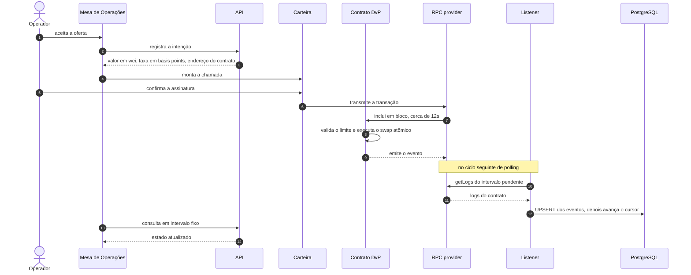

# Arquitetura

Backend da PoC de crédito interfinanceiro (CDI) overnight — Banco Inter × Inteli Blockchain.

## Contexto

Bancos emprestam reservas entre si por um dia útil (overnight) para fechar o caixa dentro do mínimo regulatório. A taxa média dessas operações é o CDI. Hoje a negociação leva minutos e a liquidação leva horas, por conta de checagem manual de limite e conciliação. Nessa janela existe risco de contraparte: a operação foi combinada mas ainda não foi consumada.

A PoC elimina essa janela. O contrato inteligente valida o limite e executa a troca — token de crédito de um lado, ativo de liquidação do outro — em uma única transação atômica (DvP, *delivery versus payment*). Ou as duas pernas acontecem, ou nenhuma.

## Stack

| Camada | Escolha |
|---|---|
| Runtime | Node.js 24 LTS — `.nvmrc` fixa `24`; Active LTS até 2026-10-20, Maintenance LTS até 2028-04-30 |
| Linguagem | TypeScript, modo estrito |
| HTTP | Fastify 5 |
| Banco | PostgreSQL |
| Acesso ao banco | `pg` + migrations SQL versionadas |
| Leitura on-chain | `viem` (somente leitura) |
| Rede | Sepolia (testnet) |

Sem ORM: a modelagem exige diagrama entidade-relacionamento explícito e migrations versionadas, e SQL puro deixa isso literal.

## Diagrama

Duas vistas, cada uma respondendo a uma pergunta diferente. A estrutura, com os componentes e quem fala com quem, fica no [README](../README.md#arquitetura); lá o bloco Web2 distingue o que existe do que ainda é alvo. A ordem do caminho de uma operação fica aqui, porque é a ordem que o orçamento de latência mede.



Nenhuma seta é empurrada pelo servidor. O listener e o frontend descobrem a mudança no ciclo seguinte, e é isso que o orçamento de latência cobra.

## Componentes

### Mesa de Operações (React)

Exibe ofertas abertas, limites disponíveis e status das operações (RF04). Não decide nada: renderiza o que a API devolve. Descobre mudanças de status perguntando à API periodicamente.

### Carteira (MetaMask)

Guarda a chave privada do operador e assina as transações. É ela — não o backend — que chama o contrato. A interface precisa tratar três recusas comuns: assinatura negada, rede errada e saldo de gas insuficiente.

### API (Fastify)

Rotas de oferta, aceite, cancelamento e histórico (RF05, RF06). As rotas de oferta e aceite **registram a intenção** e devolvem ao frontend o que ele precisa para montar a chamada ao contrato; elas não executam a operação. A execução é on-chain.

### Listener de eventos (viem)

Lê os eventos do contrato na Sepolia por polling, com cursor, e grava o resultado no Postgres: status, hash da transação, número do bloco, timestamp, partes e taxa (RNF03). É a costura entre Web3 e Web2, e o componente mais crítico do backend.

### PostgreSQL

Contrapartes, limites, histórico de operações e o cursor de sincronização. É sempre um espelho atrasado da chain, nunca a fonte de verdade.

### RPC provider

Nó de terceiro (Alchemy/Infura) pelo qual frontend e listener alcançam a Sepolia.

### Contratos (Solidity/Foundry)

Contrato de liquidação DvP e token ERC-20 fictício representando o crédito. Fora do escopo deste repositório; o backend consome apenas o ABI publicado.

## Decisões

### O backend não assina transações

`viem` é usado somente para leitura. Quem assina é a carteira do operador.

Alternativa descartada: backend com chave custodial (relayer). Seria mais fácil de demonstrar, mas colocaria o backend no caminho crítico da liquidação e enfraqueceria o argumento central do projeto — a operação acontece no contrato, sem intermediário confiável.

Consequência: o backend é fonte de verdade off-chain e indexador, nunca executor.

### O listener é um cursor, e o gatilho é polling

Um watcher (`watchContractEvent`) só entrega o que acontece enquanto está ligado. Qualquer parada, seja deploy, restart ou oscilação de rede, perde de forma definitiva os eventos daquele intervalo.

O listener guarda no Postgres o último bloco processado e, a cada ciclo, busca os logs do intervalo pendente. Se o processo cair em qualquer ponto, ele recomeça do último bloco processado.

```
cursor = lê o cursor do banco
atual  = client.getBlockNumber()
enquanto cursor < atual:
  fatia  = menor entre o teto por chamada e o que falta até atual
  logs   = client.getLogs({ address, fromBlock: cursor + 1, toBlock: cursor + fatia })
  grava os logs com UPSERT
  cursor = cursor + fatia
escreve o cursor e a janela de hashes
```

O laço não é decorativo. O provedor público recusa faixa larga de blocos, então uma parada longa precisa de várias chamadas até alcançar o cabeçalho da cadeia, e o cursor só avança depois de a gravação ter passado.

Sobre o gatilho, o listener pergunta ao provedor a cada ciclo e não abre conexão persistente. O argumento que sustentava o push era a latência, e ele é mais fraco do que parecia: o push entrega assim que o evento aparece, mas não recupera o que passou enquanto o canal esteve fora. A conexão pode continuar aberta e parar de entregar, sem erro, e todo evento daquele intervalo se perde. O cursor é obrigatório de qualquer forma, porque é ele que garante que nada se perde. O push economizaria o intervalo de um ciclo, ao preço de uma segunda forma de falha para operar e observar. Polling tem uma forma de falha só, e ela é visível: o cursor para de avançar.

O gatilho fica isolado em uma função, e o restante do listener não sabe como ele é disparado. Se o polling se mostrar insuficiente na Sepolia, trocar por WebSocket sobre o mesmo cursor é uma alteração de uma linha naquele ponto.

### A gravação é idempotente

`UPSERT` por chave natural `(tx_hash, log_index)`. O mesmo evento será reprocessado — em restart, em retry do RPC, em reorg — e reprocessar não pode duplicar histórico.

Efeito colateral relevante: idempotência é também o que permite rodar mais de uma instância do listener em paralelo, caso um dia seja preciso redundância.

### Proteção contra reorg

A Sepolia reorganiza os últimos blocos de vez em quando, então o processamento não pode assumir que o que foi gravado hoje continua na cadeia amanhã.

A proteção usual seria processar com atraso de alguns blocos. Com o bloco da Sepolia medido em 12s, dois blocos de atraso levam o total a cerca de 39s contra os 30s do RNF02, e nenhum atraso que caiba nesse orçamento compra garantia: a finalização da prova de participação leva cerca de 12,8 minutos.

A escolha é detecção com reparo, que não atrasa o caminho feliz. A cada ciclo o listener relê uma janela de blocos, compara o hash de cada altura com o que guardou e, quando um hash deixa de casar, marca os eventos daquela altura como removidos e reconstrói a projeção afetada. A releitura do recibo canônico decide o desfecho de cada transação: se ela continua viva em outro bloco da cadeia vencedora, altura, índice e hash são atualizados; se não continua, a operação vai para `orphaned`.

O que esse mecanismo não faz é impedir que um estado errado apareça na tela entre o reorg e o ciclo seguinte. Evitar isso exigiria o atraso que não cabe no orçamento.

`block_number` e `block_hash` são registrados em cada operação. O número sozinho não detecta reorg, porque a altura permanece a mesma e o conteúdo muda.

## Orçamento de latência (RNF02: 30 segundos)

O orçamento do caminho feliz, com o transporte aceito:

| Etapa | Pior caso |
|---|---|
| Transação incluída em bloco (Sepolia) | ~12s |
| Listener lê o intervalo pendente (ciclo seguinte de polling) | até o intervalo do ciclo, sem valor declarado (`P10` na arquitetura do backend) |
| Gravação no Postgres | ~ms |
| Frontend percebe a mudança (consulta à API em intervalo fixo) | 3s, premissa deste documento |
| Total | ~15s mais o intervalo do ciclo |

O total não fecha sem o intervalo do ciclo, e ele é o único termo em aberto: o tempo de bloco da Sepolia não está sob controle do backend, a gravação é da ordem de milissegundos e os 3s do frontend são premissa deste documento, não medição. Com um ciclo de até 15 segundos o total ainda cabe nos 30 segundos do RNF02; acima disso, não cabe. Fixar o intervalo é decisão da equipe do backend, e é o que torna este orçamento decidível.

O requisito segue sem definição formal de início e fim. "Confirmação visível até 30 segundos após aceite" não diz se o relógio começa no envio da transação, na inclusão em bloco ou no aceite, nem se termina quando o estado chega à tela ou quando ele deixa de ser revertível. A leitura adotada é a primeira: o requisito mede a chegada do estado à tela. A segunda medida, a confirmação, é publicada como número separado e não é o que esta tabela mede.

## Riscos conhecidos

**O listener falha em silêncio.** Se ele parar, o sistema continua aparentemente funcionando: a chain avança, o banco congela, a interface mostra dados desatualizados sem indicar erro. Mitigação: registrar o timestamp da última sincronização e expô-lo na API, sinalizando na interface quando ultrapassar um minuto.

**Estado órfão.** A oferta é gravada como `ofertada` no passo 1, mas o operador pode não assinar no passo 3. Mitigação: estado `pendente` com validade, promovido a `ofertada` apenas quando o evento correspondente for indexado.

**Limite de crédito em duas fontes.** O contrato valida um limite on-chain; o Postgres guarda outro para exibição. Divergência faz o aceite falhar sem explicação na interface. Exige definição, junto ao time de contratos, de quem sincroniza e com que frequência.

### Lista de eventos e ABI seguem pendentes de terceiro

Este documento descreve o listener e a projeção de dados como se os eventos e a ABI já existissem. Eles não existem. A máquina de estados e a interface preliminar, com funções, eventos, erros, identificadores e unidades, têm prazo esperado de 2026-09-20, e a ABI final versionada, de 2026-10-11. As duas seguem `Blocked`, e quem deve fechá-las é o time de contratos: o backend é consumidor. Enquanto isso não acontecer, o listener, o diagrama de dados e a decisão sobre nomes, unidades e escala descrevem uma interface que ninguém acordou, e nada aqui deve ser lido como contrato fechado com o time de contratos.

## Caminho para produção

As decisões acima são adequadas a uma PoC em testnet pública. Um sistema em produção no Inter partiria de premissas diferentes:

**Nó próprio, não provedor de terceiro.** Infraestrutura de liquidação não depende de RPC externo. Com nó dedicado, desaparecem o rate limit, o custo por chamada e o limite de conexões simultâneas que um provedor compartilhado impõe.

**Rede permissionada, não Sepolia.** Redes com finalização imediata (Besu/QBFT e similares) não sofrem reorg, o que elimina uma classe inteira de preocupações do indexador. A escolha da rede é objeto do benchmark entregue em paralelo a este repositório.

**Conexão mais estável, mesmo desenho.** O gatilho por polling sobre cursor é o desenho adotado; com nó dedicado ele deixa de sofrer o teto de chamadas e as quedas típicas de um RPC compartilhado. O cursor continua obrigatório, e nenhum mecanismo de push dispensa ele: nenhum push sobrevive a um deploy sem perder eventos.

**Listener redundante.** Mais de uma instância, viável sem alteração de código graças à idempotência da gravação.

**Indexer dedicado.** Com dezenas de contratos, o listener artesanal dá lugar a uma solução própria ou pronta (Ponder, Subsquid), com fila entre leitura e gravação, dead-letter e reprocessamento seletivo.
