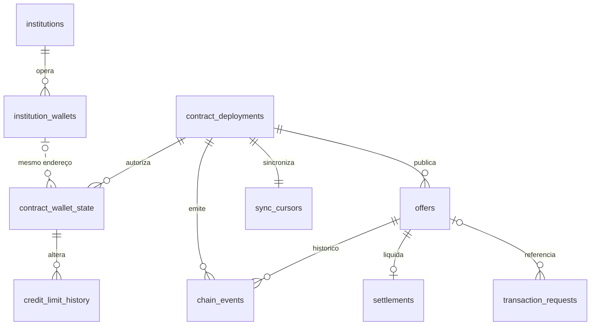

# Modelo de dados — contrato DvP

Modelo para a PoC em Sepolia, baseado no **Guia de modelagem para o backend — contrato DvP** e na interface/implementação da branch [`feat/escopo-reduzido-dvp`](https://github.com/anacampos-crypto/projeto-inter-web3/tree/b68cf40732519c8b0eae2d300644676f75a95016). [`migrations/001_initial_schema.sql`](../migrations/001_initial_schema.sql) define o esquema e [`002_institution_wallets.sql`](../migrations/002_institution_wallets.sql) permite várias carteiras por instituição; `npm run db:setup` (ou o serviço `setup` do compose) aplica as migrations e grava a massa de demonstração (`src/db/seed.ts`). A API lê e grava nestas tabelas por `src/db/pg-store.ts`; o listener ainda não existe.

| Tabela | Função |
| --- | --- |
| `institutions` | Nome e CNPJ off-chain de cada banco. Nunca publicar esses dados na chain. |
| `contract_deployments` | Rede, endereços do contrato DvP, BRLt e NFT, e bloco inicial do indexador. Chave primária composta `(chain_id, contract_address)` (veja abaixo). |
| `institution_wallets` | Carteiras de cada banco: **uma instituição tem várias carteiras**, cada carteira pertence a uma instituição. Cadastro off-chain, válido para qualquer deployment (o endereço EVM é o mesmo em todas as redes). |
| `contract_wallet_state` | Estado on-chain de cada carteira **por contrato**: cadastro ativo e limite disponível. O limite é por carteira, como no contrato. O banco dono é obtido por `institution_wallets` pelo endereço; uma carteira vista on-chain sem vínculo continua válida (aparece com `institution: null`). |
| `offers` | Uma linha por oferta confirmada, identificada por `(chain_id, contract_address, onchain_offer_id)`; ofertante e tomador são carteiras **direcionadas**. |
| `chain_events` | Logs do `CreditInterbankOffer`, incluindo cadastro, limite e ciclo da oferta. Chave idempotente `(chain_id, contract_address, tx_hash, log_index)`. |
| `credit_limit_history` | Cada `CreditLimitUpdated` e cada débito causado por `OfferSettled`, com limite anterior/novo e evento de origem. |
| `settlements` | Uma liquidação DvP por oferta, com hash, bloco, horário e `position_token_id` do NFT CDIP. |
| `transaction_requests` | Intenções da API ainda não confirmadas on-chain; incluem criar, aceitar, rejeitar e cancelar. |
| `sync_cursors` | Último bloco processado pelo listener, por contrato implantado. |
| `schema_migrations` | Histórico técnico do runner (`nome`, checksum SHA-256, data de aplicação); criado e atualizado sob advisory lock. Não é entidade do domínio DvP. |

## Por que `contract_deployments` tem duas colunas na chave

Não são duas chaves primárias: é **uma** chave primária composta, `PRIMARY KEY (chain_id, contract_address)` (o diagrama marca `PK` em cada coluna que participa dela). As duas colunas juntas identificam um contrato:

- o **mesmo endereço pode existir em redes diferentes** — um deploy na Sepolia (`11155111`) e outro numa rede local Anvil/Hardhat (`31337`) podem cair no mesmo endereço, porque ele deriva da carteira e do nonce do deployer, não da rede;
- a **mesma rede recebe vários deploys** — cada redeploy na Sepolia gera um endereço novo, e os dados do anterior continuam consultáveis.

Por isso toda tabela on-chain (`contract_wallet_state`, `offers`, `chain_events`, `sync_cursors`…) referencia `contract_deployments` pelo par `(chain_id, contract_address)`: um evento, oferta ou limite só faz sentido dentro de um contrato específico de uma rede específica. Um id sintético (`uuid`) evitaria a chave de duas colunas, mas cada tabela ainda precisaria guardar rede e endereço para o listener casar os logs, e a unicidade do par teria de ser garantida à parte.

## Migrations

| Arquivo | O que faz |
| --- | --- |
| `001_initial_schema.sql` | Esquema inicial da projeção. |
| `002_institution_wallets.sql` | Cria `institution_wallets`, copia os vínculos que estavam em `contract_wallet_state.institution_id` e remove essa coluna (e a restrição de uma carteira por banco em cada contrato). |

Migrations aplicadas **não são editadas**: o runner guarda o checksum de cada arquivo e recusa um arquivo alterado. Mudanças de esquema entram como um novo arquivo `NNN_nome.sql`, aplicado por `npm run db:setup` ou pelo serviço `setup` do compose.

## Unidades e estados

- `amount_cents` e limites: centavos de BRLt (`100000000` = R$ 1.000.000,00; token com 2 decimais).
- `rate_cdi_bps`: pontos-base da porcentagem do CDI (`10000` = 100% CDI; `10500` = 105% CDI). `term_days` é o prazo do empréstimo em dias; `validity_seconds` e `expires_at` são a validade da **oferta**.
- Inteiros do ABI (`uint256`) usam `numeric(78,0)`; endereços e hashes completos são normalizados para hexadecimal minúsculo. Horários Unix do contrato/bloco viram `timestamptz`.
- `offers.status` guarda os números estáveis do contrato: `0 Offered`, `2 Settled`, `3 Cancelled`, `4 Expired`, `5 Rejected`. `1 Accepted` aparece em `chain_events`, mas não como estado persistido: o aceite e a liquidação ocorrem na mesma transação.

## Projeção planejada pelo listener

1. Processar somente logs de `CreditInterbankOffer`, em ordem de bloco/log; inserir `chain_events` com `ON CONFLICT DO NOTHING`. Aplicar a projeção **somente se o log foi inserido**. Atualizar `sync_cursors` na mesma transação SQL. Em reorg, comparar `block_hash`; o tratamento de rollback ainda precisa ser implementado.
2. `InstitutionRegistered`/`InstitutionRevoked` alteram `contract_wallet_state.is_registered` (o listener cria a linha se a carteira for nova; o vínculo com o banco vem de `institution_wallets`). `CreditLimitUpdated` substitui o limite e gera histórico. `OfferCreated` cria `offers` com horário do bloco. `OfferRejected`, `OfferCancelled` e `OfferExpired` encerram a oferta.
3. `OfferAccepted` fica no histórico. `OfferSettled` grava `settlements`, muda a oferta para `2` e **subtrai `amount_cents` do limite do tomador**, pois o contrato não emite `CreditLimitUpdated` nesse débito. Reconciliar com `availableLimit()` no mesmo bloco quando possível.
4. Se `status = 0` e `expires_at <= now()`, a API apresenta `Expired` mesmo sem `OfferExpired`; não grava um evento fictício. Reversão por limite, saldo ou `approve` também não gera evento: a oferta permanece `Offered`.

## Contrato com a API

- Antes de criar a oferta, listar **outras** carteiras cadastradas com `available_limit_cents >= amount_cents`; o contrato revalida esse limite na criação e no aceite.
- Listagens de ofertas liquidadas devem retornar a oferta apenas para ofertante e tomador **após autenticar a carteira**. A Sepolia continua pública; essa regra limita somente a API. A autenticação ainda não existe no backend atual.
- O comprovante para registro na Selic pode ser gerado de `offers` + `settlements` + `chain_events` (partes, valor, taxa, timestamp e hash). Os campos finais exigidos pelo Inter ainda não foram confirmados; nenhuma tabela de comprovantes é necessária nesta migration.
- No fluxo alvo, a carteira assina; uma API autenticada poderá registrar a intenção e receber o hash. Eventos sem intenção correspondente ainda precisam ser indexados; a projeção de `settlements` deverá alimentar `/api/operations` e `/api/operations/:txHash`. Hoje essas rotas já leem `settlements` no PostgreSQL, alimentado pelo seed e pelas transições `/api/mock`.

**Limite da entrega:** a API persiste e consulta a projeção, mas não há listener, indexação on-chain, autenticação, reconciliação ou rollback de reorg; o conteúdo vem do seed e da simulação. A migration guarda somente o hash do cursor, sem janela de hashes por bloco necessária à correção de reorg.
