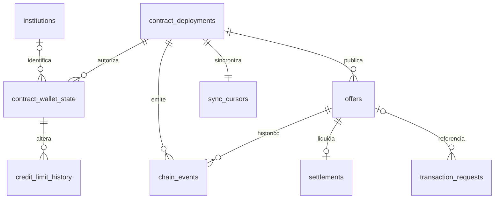

# Modelo de dados — contrato DvP

Modelo para a PoC em Sepolia, baseado no **Guia de modelagem para o backend — contrato DvP** (equipe Web3, 28/09/2026) e na interface/implementação da branch [`feat/escopo-reduzido-dvp`](https://github.com/anacampos-crypto/projeto-inter-web3/tree/b68cf40732519c8b0eae2d300644676f75a95016). A [migration inicial](../migrations/001_initial_schema.sql) cria o esquema; a API e o listener ainda usam mocks/não foram ligados ao PostgreSQL.

| Tabela | Função |
| --- | --- |
| `institutions` | Nome e CNPJ off-chain de cada banco. Nunca publicar esses dados na chain. |
| `contract_deployments` | Rede, endereços do contrato DvP, BRLt e NFT, e bloco inicial do indexador. |
| `contract_wallet_state` | Carteira por contrato, vínculo opcional com banco, cadastro ativo e limite disponível atual. A associação do banco é feita fora da chain. |
| `offers` | Uma linha por oferta confirmada, identificada por `(chain_id, contract_address, onchain_offer_id)`; ofertante e tomador são carteiras **direcionadas**. |
| `chain_events` | Logs do `CreditInterbankOffer`, incluindo cadastro, limite e ciclo da oferta. Chave idempotente `(chain_id, contract_address, tx_hash, log_index)`. |
| `credit_limit_history` | Cada `CreditLimitUpdated` e cada débito causado por `OfferSettled`, com limite anterior/novo e evento de origem. |
| `settlements` | Uma liquidação DvP por oferta, com hash, bloco, horário e `position_token_id` do NFT CDIP. |
| `transaction_requests` | Intenções da API ainda não confirmadas on-chain; incluem criar, aceitar, rejeitar e cancelar. |
| `sync_cursors` | Último bloco processado pelo listener, por contrato implantado. |

## Unidades e estados

- `amount_cents` e limites: centavos de BRLt (`100000000` = R$ 1.000.000,00; token com 2 decimais).
- `rate_cdi_bps`: pontos-base da porcentagem do CDI (`10000` = 100% CDI; `10500` = 105% CDI). `term_days` é o prazo do empréstimo em dias; `validity_seconds` e `expires_at` são a validade da **oferta**.
- Inteiros do ABI (`uint256`) usam `numeric(78,0)`; endereços e hashes completos são normalizados para hexadecimal minúsculo. Horários Unix do contrato/bloco viram `timestamptz`.
- `offers.status` guarda os números estáveis do contrato: `0 Offered`, `2 Settled`, `3 Cancelled`, `4 Expired`, `5 Rejected`. `1 Accepted` aparece em `chain_events`, mas não como estado persistido: o aceite e a liquidação ocorrem na mesma transação.

## Projeção pelo listener

1. Processar somente logs de `CreditInterbankOffer`, em ordem de bloco/log; inserir `chain_events` com `ON CONFLICT DO NOTHING`. Aplicar a projeção **somente se o log foi inserido**. Atualizar `sync_cursors` na mesma transação SQL. Em reorg, comparar `block_hash`; o tratamento de rollback ainda precisa ser implementado.
2. `InstitutionRegistered`/`InstitutionRevoked` alteram `contract_wallet_state.is_registered`. `CreditLimitUpdated` substitui o limite e gera histórico. `OfferCreated` cria `offers` com horário do bloco. `OfferRejected`, `OfferCancelled` e `OfferExpired` encerram a oferta.
3. `OfferAccepted` fica no histórico. `OfferSettled` grava `settlements`, muda a oferta para `2` e **subtrai `amount_cents` do limite do tomador**, pois o contrato não emite `CreditLimitUpdated` nesse débito. Reconciliar com `availableLimit()` no mesmo bloco quando possível.
4. Se `status = 0` e `expires_at <= now()`, a API apresenta `Expired` mesmo sem `OfferExpired`; não grava um evento fictício. Reversão por limite, saldo ou `approve` também não gera evento: a oferta permanece `Offered`.

## Contrato com a API

- Antes de criar a oferta, listar **outras** carteiras cadastradas com `available_limit_cents >= amount_cents`; o contrato revalida esse limite na criação e no aceite.
- Listagens de ofertas liquidadas devem retornar a oferta apenas para ofertante e tomador **após autenticar a carteira**. A Sepolia continua pública; essa regra limita somente a API. A autenticação ainda não existe no backend atual.
- O comprovante para registro na Selic pode ser gerado de `offers` + `settlements` + `chain_events` (partes, valor, taxa, timestamp e hash). Os campos finais exigidos pelo Inter ainda não foram confirmados; nenhuma tabela de comprovantes é necessária nesta migration.
- A carteira assina; a API registra a intenção e depois recebe o hash enviado pelo frontend. Eventos sem intenção correspondente continuam indexados. `settlements` alimenta `/api/operations` e `/api/operations/:txHash`.

**Limite da entrega:** a migration define tabelas e restrições, mas não implementa autenticação, rotas, listener, reconciliação nem conexão `pg`.
